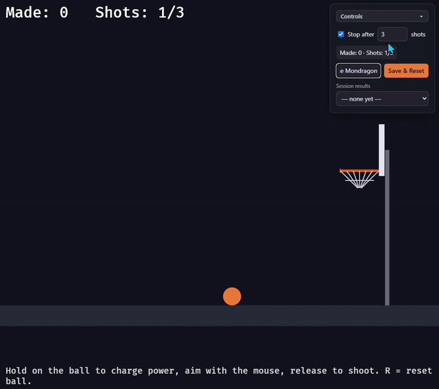

# 🏀 Rust + Bevy: From Beginner to Engineer

**Build a physics-based basketball game that runs in the browser — starting from zero.**

*Read this in: **English** | [Español](README.es.md)*

*▶ [Watch a full one-minute game session (video)](assets/gameplay-session.mp4)*

This is a free, hands-on course. You start with nothing installed and finish with a complete game — hold-to-charge shooting, real gravity and bounce physics, scoring, and game sessions — written in **Rust** with the **Bevy** game engine, compiled to **WebAssembly**, and playable in any modern browser.

No prior Rust experience is required. No prior game development experience is required. Every language concept (ownership, enums, traits…) is explained the first time the game code needs it.

## Why this course exists

I built this basketball game while learning Rust and Bevy myself, and along the way I hit everything that makes game-dev tutorials frustrating for beginners: guides written for engine versions that no longer exist, commands that assume tools you were never told to install, and errors that the author apparently never encountered — because they never actually ran their own steps.

So this course is built on three promises:

1. **Everything here was actually executed.** Every command was run, every code block compiles at exactly the point in the course where it appears, and every screenshot is a real capture of the real build. When the course quotes a compile time or a file size, it's a measurement, not a guess.
2. **The errors are real.** The troubleshooting boxes document failures that actually happened while building this game — the missing linker, the stale PATH, the port conflict, the version-mismatch wall. You'll probably hit some of them; the fix will be waiting.
3. **Versions are pinned, always.** Nothing here says "latest." Everything is tested against the exact versions listed below, so the course you read is the course that works.

And it's **bilingual** — every chapter exists in English and Spanish — because good Rust and Bevy material in Spanish is scarce, and learning something this dense in a second language shouldn't be the price of entry.

If this course helps you, a ⭐ on the repo helps the next learner find it.

## What you'll build

A 2D basketball shooting game where you:

- Hold to charge your shot power and aim before releasing
- Watch the ball fly with real gravity, bounce off the rim and backboard
- Score points and track your results across a game session with a shot limit
- Control the game from an HTML panel (player name, results, reset) that talks directly to the Rust code

And along the way you'll learn what makes this course go "to engineer": Entity-Component-System architecture, refactoring a one-file prototype into modules and plugins, tuning build profiles for tiny WASM bundles, and deploying to the web.

## The chapters

Every chapter folder contains the lesson **and** a complete, runnable snapshot of the project at that point. Lost? Jump into any chapter's folder and continue from there.

### Part I — Getting ready
| # | Chapter | You will |
|---|---|---|
| 00 | [Before you start](chapters/00-before-you-start/README.md) | See what you're building and check requirements |
| 01 | [Installing the toolchain](chapters/01-installing-the-toolchain/README.md) | Install Rust, the build tools, Trunk, and VS Code |
| 02 | [Hello, Cargo](chapters/02-hello-cargo/README.md) | Create and run your first Rust program |

### Part II — First steps with Bevy
| # | Chapter | You will |
|---|---|---|
| 03 | [Your first window](chapters/03-first-window/README.md) | Open a Bevy game window |
| 04 | [ECS: entities, components, systems](chapters/04-ecs-entities-components-systems/README.md) | Draw your first sprite and understand Bevy's architecture |
| 05 | [Making things move](chapters/05-making-things-move/README.md) | Animate with systems, queries, and delta time |
| 06 | [Running in the browser](chapters/06-running-in-the-browser/README.md) | Compile to WebAssembly and serve with Trunk |

### Part III — Building the basketball game
| # | Chapter | You will |
|---|---|---|
| 07 | [The court](chapters/07-the-court/README.md) | Draw the court, hoop, backboard, and ball |
| 08 | [The shooting mechanic](chapters/08-the-shooting-mechanic/README.md) | Implement hold-to-charge input and aiming |
| 09 | [Physics](chapters/09-physics/README.md) | Add gravity, velocity, and bouncing |
| 10 | [Scoring and feedback](chapters/10-scoring-and-feedback/README.md) | Detect baskets and show the score |
| 11 | [Game sessions](chapters/11-game-sessions/README.md) | Add shot limits, results, and reset |

### Part IV — From beginner to engineer
| # | Chapter | You will |
|---|---|---|
| 12 | [Talking to the web page](chapters/12-talking-to-the-web-page/README.md) | Bridge Rust ↔ HTML with wasm-bindgen |
| 13 | [Refactoring like an engineer](chapters/13-refactoring-like-an-engineer/README.md) | Split the game into modules and Bevy plugins |
| 14 | [Optimizing and shipping](chapters/14-optimizing-and-shipping/README.md) | Shrink the WASM bundle and deploy to the web |

## Requirements at a glance

- **OS**: Windows 10/11, macOS, or Linux (screenshots in this course use Windows 11)
- **Disk**: ~10 GB free (the Rust toolchain and build artifacts are large)
- **Editor**: we use **VS Code**, but any editor or IDE works
- **Experience**: none — this course starts from zero

> [!IMPORTANT]
> This course pins exact versions so every code block compiles as written: **Rust 1.96.0**, **Bevy 0.16**, **Trunk 0.21.14**, **wasm-bindgen 0.2.122**. Newer versions of Bevy change its API — use the pinned versions while following along.

## How to use this course

1. Read chapters in order — each builds on the last.
2. Type the code yourself instead of copy-pasting; that's where the learning happens.
3. Stuck or broken build? Compare your code against the chapter's snapshot folder.
4. Look for the callout boxes:
   - **Note** — a Rust language concept, explained at first use
   - **Warning** — a real error you may hit, with its real fix
   - **Tip** — shortcuts and quality-of-life improvements

**Start here → [Chapter 0: Before you start](chapters/00-before-you-start/README.md)**

## License

[MIT](LICENSE) — use the code and lessons freely, for learning or anything else.
