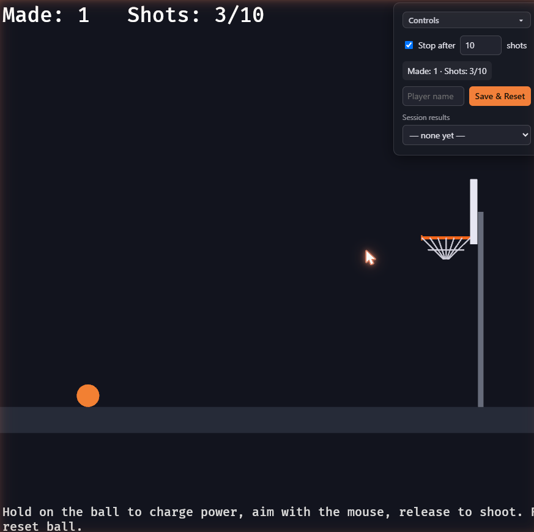

# Capítulo 0 — Antes de empezar

*Léelo en: [English](README.md) | **Español***

¡Bienvenido! Antes de instalar nada, este capítulo corto te muestra a dónde vas, qué necesitas y cómo funciona el curso. Diez minutos aquí te ahorrarán horas después.

## Qué vas a construir

Al terminar este curso habrás construido — y entendido, línea por línea — este juego:

Es un juego 2D de tiros de baloncesto que corre **en el navegador**:

- **Tiro con carga progresiva** — mantén pulsado y un medidor de potencia se carga; apunta con el cursor; suelta para tirar.
- **Físicas reales** — la pelota sigue un arco de gravedad y rebota contra el suelo, el tablero y el aro.
- **Puntuación** — el juego detecta las canastas limpias y actualiza tu puntuación con feedback visual.
- **Sesiones de juego** — juega con un límite de tiros, mira tus resultados, escribe tu nombre y reinicia — todo desde un panel de control HTML que habla directamente con el código Rust del juego.

Tres tecnologías hacen que esto funcione en conjunto:

| Tecnología | Qué es | Su papel en nuestro juego |
|---|---|---|
| **Rust** | Un lenguaje de programación de sistemas, rápido y seguro en memoria | El lenguaje en el que está escrita toda la lógica del juego |
| **Bevy** | Un motor de juegos moderno, libre y de código abierto, escrito en Rust | Ventanas, renderizado, input y el game loop, para que nos centremos en *nuestro* juego |
| **WebAssembly (WASM)** | Un formato binario que los navegadores ejecutan a velocidad casi nativa | Permite que nuestro juego compilado en Rust corra en Chrome, Firefox, Safari o Edge — sin instalar nada para jugar |

## Para quién es este curso

**Para principiantes absolutos.** No necesitas saber Rust. No necesitas haber hecho un juego antes. Si has escrito *algo* de código en *cualquier* lenguaje (aunque sea poco), irás cómodo; si no, necesitarás paciencia, pero nada más.

El título del curso dice "a ingeniero" y lo dice en serio: los primeros capítulos te llevan de la mano por la instalación y los primeros programas, y los capítulos finales cubren cosas que hacen los desarrolladores profesionales — arquitectura de software (ECS, módulos, plugins), ajuste de rendimiento, optimización del tamaño del bundle y despliegue.

## Cómo funciona el curso

**Cada capítulo tiene su propia carpeta, y cada carpeta contiene una copia completa y funcional del proyecto tal como queda al final de ese capítulo.** Si tu código se rompe y no encuentras el porqué, compáralo con la carpeta del capítulo — o copia la carpeta del capítulo y sigue desde ahí. Nunca puedes quedarte atascado para siempre.

Mientras lees, verás cuatro tipos de cajas de aviso:

> [!NOTE]
> **Sidebar de Rust.** Cajas como esta explican un concepto del lenguaje Rust — ownership, enums, traits — en el momento exacto en que el código del juego lo usa por primera vez. Nada de teoría antes de necesitarla.

> [!WARNING]
> **Troubleshooting.** Cajas como esta describen un error *real*, con el mensaje *real* que verás y su solución. Cada una de ellas nos pasó de verdad construyendo este juego.

> [!TIP]
> Los **Tips** son atajos opcionales y mejoras de calidad de vida.

> [!IMPORTANT]
> Las cajas **Important** no son opcionales — normalmente son versiones fijadas o pasos que lo rompen todo si se saltan.

## Qué necesitas

### Un ordenador

- **Sistema operativo**: Windows 10/11, macOS o Linux. Las capturas del curso son de **Windows 11**, y los pasos específicos de Windows (como las Visual Studio Build Tools) se cubren en detalle — pero todos los capítulos funcionan en los tres sistemas, y señalamos las diferencias donde existen.
- **Espacio en disco**: unos **10 GB libres**. Esto sorprende: Rust ocupa ~1.5 GB, las build tools de Windows varios GB, y la carpeta de compilación `target/` de un proyecto Bevy llega fácilmente a 5+ GB. Es normal.
- **Memoria**: 8 GB de RAM mínimo; con 16 GB compilar es notablemente más agradable.
- **Internet**: necesario para descargar herramientas y dependencias (unos pocos GB en total, sobre todo en los capítulos 1 y 3).

### Un editor

Usamos **Visual Studio Code** (gratuito) con la extensión **rust-analyzer**, y eso es lo que verás en todas las capturas. rust-analyzer te da autocompletado, errores en línea y saltar-a-definición — para un principiante, solo los errores en línea ya valen la pena.

**Pero cualquier editor o IDE sirve.** RustRover, Zed, Helix, Vim, Neovim, Sublime Text — Rust compila desde la línea de comandos, así que el editor es elección tuya. Si ya tienes un favorito, quédatelo; solo busca su soporte de rust-analyzer (o de Rust integrado).

### Las herramientas que instalaremos en el Capítulo 1

No necesitas instalarlas ahora — el Capítulo 1 recorre cada una paso a paso. Esto es solo para que sepas qué viene y por qué:

| Herramienta | Versión que usamos | Para qué la necesitamos |
|---|---|---|
| **rustup** | 1.29.0 | El instalador oficial de Rust y gestor de versiones |
| **Rust (rustc + cargo)** | 1.96.0 | El compilador, y Cargo — la herramienta de build y gestor de paquetes de Rust |
| **Visual Studio Build Tools** | 2022 | *(solo Windows)* el linker que Rust necesita para producir archivos `.exe` |
| **Target wasm32-unknown-unknown** | — | Le enseña al compilador de Rust a producir WebAssembly en vez de un programa de Windows/macOS/Linux |
| **Trunk** | 0.21.14 | Compila y sirve apps Rust WASM para el navegador con un solo comando |
| **VS Code + rust-analyzer** | la última va bien | El editor (la única herramienta donde "la última" es seguro) |

> [!IMPORTANT]
> **En este curso las versiones importan.** Bevy cambia su API entre versiones — el código escrito para Bevy 0.16 (este curso) no compila en Bevy 0.17 o posterior. Donde el curso indique una versión, usa exactamente esa versión mientras lo sigues. Cuando termines el curso, actualizar es un ejercicio excelente — y para entonces sabrás leer las guías de migración de Bevy por tu cuenta.

### Lo que *no* necesitas

- ❌ Conocimientos previos de Rust
- ❌ Experiencia en desarrollo de videojuegos
- ❌ Matemáticas más allá de la aritmética — introducimos la poca matemática vectorial que usamos (posiciones y velocidades son solo pares de números)
- ❌ Una GPU o un PC gamer — este juego 2D corre en cualquier portátil reciente

## Checklist antes del Capítulo 1

- [ ] Tengo ~10 GB de disco libres
- [ ] Tengo una conexión a internet estable para las descargas
- [ ] He elegido un editor (VS Code si tienes dudas)
- [ ] Entiendo que las versiones fijadas no son opcionales

## Qué sigue

En el **Capítulo 1** instalarás la toolchain completa — Rust, las build tools, el target de WebAssembly y Trunk — y verificarás que cada pieza funciona antes de escribir una sola línea de código. Es el capítulo menos glamuroso y donde la mayoría de tutoriales pierde a la gente, así que iremos despacio y cubriremos los errores reales que puedes encontrarte.

**[Continuar al Capítulo 1: Instalando las herramientas →](../01-installing-the-toolchain/README.es.md)**
