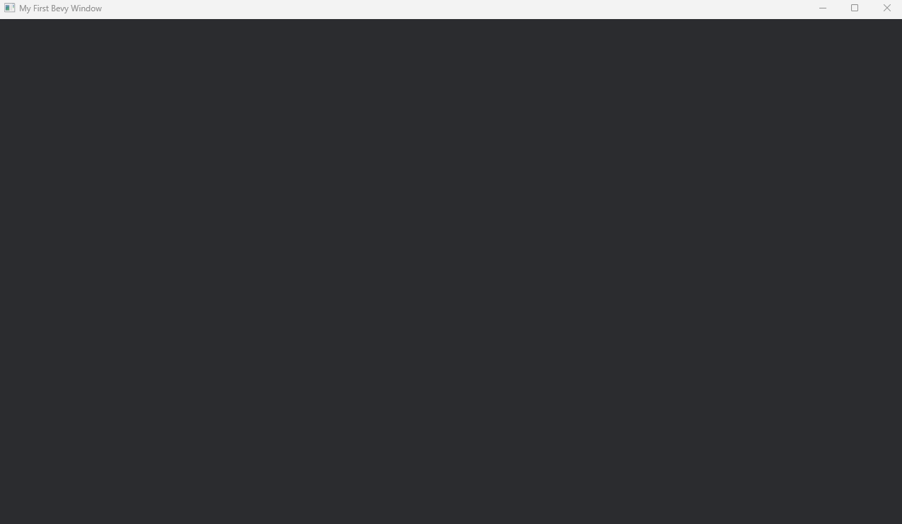

# Capítulo 3 — Tu primera ventana

*Léelo en: [English](README.md) | **Español***

En este capítulo, una línea en `Cargo.toml` convierte tu esqueleto de Rust en un proyecto de motor de juegos, y `cargo run` abre una ventana de juego real renderizada por la GPU. También aprenderás los dos hechos vitales sobre compilar Bevy — la primera compilación es lenta, todas las siguientes son rápidas — y el truco estándar que lo mantiene así.

**Tiempo**: ~30 minutos de lectura y escritura, más una compilación larga que solo pagas una vez (mira el Paso 4 — da para un café).

## Paso 1 — Crea el proyecto

```
cargo new first_window
cd first_window
```

Abre `Cargo.toml` y pon `edition = "2021"`, como estandarizamos en el Capítulo 2.

## Paso 2 — Añade Bevy

Todavía en `Cargo.toml`, añade una línea bajo `[dependencies]`:

```toml
[dependencies]
bevy = "0.16"
```

Esa es toda la instalación de un motor de juegos. En la próxima compilación, Cargo descargará Bevy y todo aquello de lo que Bevy depende, lo compilará todo y lo enlazará en tu programa.

> [!IMPORTANT]
> La versión importa: **`"0.16"`**, exactamente así. Significa "cualquier versión 0.16.x" — las actualizaciones de corrección de bugs entran, pero Cargo nunca te saltará en silencio a la 0.17, cuyos cambios de API romperían todos los bloques de código de este curso.

> [!NOTE]
> **Sidebar de Rust: ¿qué es una dependencia, en realidad?** Las bibliotecas de Rust se llaman *crates*, y se publican en un registro público: [crates.io](https://crates.io). La línea `bevy = "0.16"` le dice a Cargo: trae el crate `bevy`, versión 0.16-algo, del registro. Las versiones exactas que Cargo elige quedan registradas en `Cargo.lock`, así que tu compilación y la nuestra usan código idéntico.

## Paso 3 — El truco de velocidad de compilación

Antes de la primera compilación, añade esto al final de `Cargo.toml`:

```toml
# Build our own code lightly but dependencies fully optimized, so dev
# rebuilds stay fast while Bevy itself (the slow part) runs at full speed.
[profile.dev]
opt-level = 1

[profile.dev.package."*"]
opt-level = 3
```

Este es el razonamiento, porque este truco es práctica estándar en todo proyecto Bevy serio:

- Tus **dependencias** (Bevy y compañía) se compilan **una vez**, y se reutilizan en cada compilación posterior. Así que las optimizamos a fondo (`opt-level = 3`) — pagas una vez, y el motor corre a velocidad real incluso durante el desarrollo.
- **Tu propio código** se recompila cada vez que lo cambias — o sea, constantemente. Así que mantenemos su optimización ligera (`opt-level = 1`), haciendo rápida cada recompilación.

Sin esto, o esperarías una eternidad en cada recompilación (todo optimizado) o tendrías un juego que va a tirones (nada optimizado — y un motor de juegos sin optimizar es *muy* lento).

## Paso 4 — El código

Reemplaza `src/main.rs` con:

```rust
use bevy::prelude::*;

fn main() {
    App::new()
        .add_plugins(DefaultPlugins.set(WindowPlugin {
            primary_window: Some(Window {
                title: "My First Bevy Window".into(),
                resolution: (1280.0, 720.0).into(),
                ..default()
            }),
            ..default()
        }))
        .run();
}
```

Catorce líneas. Antes de ejecutarlo, leámoslo:

- `use bevy::prelude::*;` — importa el *prelude* de Bevy: el conjunto curado de nombres (como `App`, `Window`, `default`) que casi todo programa Bevy necesita. Una línea `use` en vez de cincuenta.
- `App::new()` — crea una aplicación Bevy vacía.
- `.add_plugins(DefaultPlugins...)` — instala el equipamiento estándar de Bevy: creación de ventanas, renderizado por GPU, gestión de input, audio, tiempo, logging. En Bevy, *todo* es un plugin — incluidas las funciones centrales del propio motor. Nuestro juego terminado añade sus propios plugins de la misma manera.
- `.set(WindowPlugin { ... })` — personaliza uno de esos plugins por defecto: le damos a la ventana un título y un tamaño de 1280×720 en vez de los valores por defecto.
- `.run()` — le entrega el control a Bevy, que abre la ventana y arranca el *game loop*: un ciclo infinito de "procesar input → actualizar el mundo → dibujar el frame", repitiéndose ~60 veces por segundo hasta que cierras la ventana. Todos los juegos a los que has jugado corren sobre este bucle; desde ahora, los tuyos también.

> [!NOTE]
> **Sidebar de Rust: el patrón builder.** `App::new().add_plugins(...).run()` es una *cadena de métodos*: cada llamada devuelve el objeto de vuelta, así que sigues llamando métodos sobre el resultado, leyendo de arriba abajo como una receta. Las APIs de Rust usan este estilo por todas partes, y el `App` de Bevy es un ejemplo clásico — extenderás esta misma cadena con tus propios sistemas en el próximo capítulo.

> [!NOTE]
> **Sidebar de Rust: structs y `..default()`.** `Window { title: ..., resolution: ..., ..default() }` crea un *struct* — un paquete de campos con nombre, como un objeto literal. Una `Window` tiene docenas de campos (opciones de cursor, transparencia, vsync…), y solo nos importan dos. El `..default()` mágico del final significa: "rellena todos los campos que no mencioné con su valor por defecto." Lo usarás constantemente en Bevy, que prefiere structs grandes y configurables. (¿Y el `Some(...)` que lo envuelve? Envuelve un valor que puede estar ausente — lo conoceremos como es debido cuando el juego lo necesite.)

## Paso 5 — Ejecútalo (y ve a por ese café)

```
cargo run
```

La primera compilación construye el árbol de dependencias completo de Bevy — cientos de crates. En nuestra máquina compiló **324 crates en 4 minutos 36 segundos** (una máquina que nunca ha compilado Rust también dedicará unos minutos extra a descargarlos primero). Verás un desfile largo de líneas `Compiling ...`; es normal, y solo lo pagas una vez por proyecto.

Cuando termina, se abre una ventana de 1280×720 con el título "My First Bevy Window":



Está vacía y oscura — sin cámara, sin sprites, nada que dibujar todavía — pero fíjate en lo que ya está corriendo: una ventana nativa, un pipeline de renderizado por GPU (ese color de fondo lo está redibujando tu tarjeta gráfica ~60 veces por segundo), captura de teclado y ratón, y un game loop vivo. Ciérrala con el botón ✕ de la ventana, y el programa termina limpiamente.

Ahora el segundo hecho vital. Cambia el título de la ventana a lo que quieras, guarda, y `cargo run` otra vez:

```
   Compiling first_window v0.1.0 (...)
    Finished `dev` profile [optimized + debuginfo] target(s) in 8.33s
```

**Ocho segundos.** Solo se recompiló *tu* crate; Bevy ya estaba construido. Este es tu ritmo de desarrollo de aquí en adelante: lento una vez, rápido para siempre.

> [!WARNING]
> **`error: linker 'link.exe' not found`** en esta compilación significa que faltan (o están incompletas) las Visual Studio Build Tools del Capítulo 1 — es exactamente el error que nos encontramos construyendo el juego original. Vuelve al [Capítulo 1, Paso 1](../01-installing-the-toolchain/README.es.md#paso-1--visual-studio-build-tools-solo-windows), instala la carga de trabajo "Desarrollo para el escritorio con C++", reinicia tu terminal y ejecuta de nuevo.

> [!TIP]
> ¿Ves warnings en la terminal mientras la ventana está abierta — menciones a `wgpu`, adaptadores gráficos o características que faltan? Mientras la ventana se haya abierto, ignóralos. El renderizador de Bevy sondea las capacidades de tu GPU y comenta lo que encuentra; es diagnóstico, no errores.

## Qué construiste / Qué sigue

Una ventana de juego real con un game loop corriendo, en catorce líneas — más las dos piezas de oficio Bevy que todo el mundo aprende primero: la versión fijada exacta y el truco del perfil de desarrollo.

Tu código debería coincidir ahora con la carpeta de este capítulo: [`chapters/03-first-window/`](.).

En el **Capítulo 4** ponemos algo *dentro* de la ventana: una cámara, un sprite — y la gran idea que organiza todo juego Bevy, incluido el nuestro: **ECS** — entidades, componentes y sistemas.

**[Continuar al Capítulo 4: ECS — entidades, componentes, sistemas →](../04-ecs-entities-components-systems/README.es.md)**
