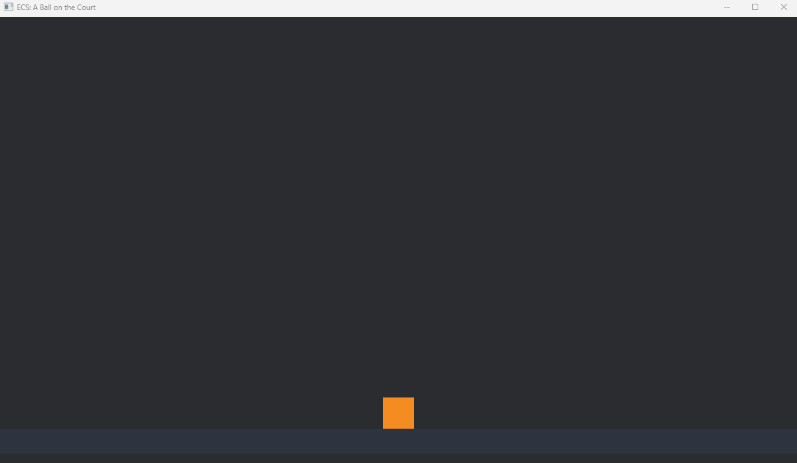

# Capítulo 4 — ECS: entidades, componentes, sistemas

*Léelo en: [English](README.md) | **Español***

Tu ventana ya abre; ahora ponemos cosas dentro. Pero primero, este capítulo enseña la idea más importante de todo el curso: **ECS**, la arquitectura que organiza todo juego Bevy — incluido nuestro juego de baloncesto, cuya pelota, aro, tablero, marcador e incluso cámara están construidos con los tres conceptos que estás a punto de conocer.

**Tiempo**: ~45 minutos.

## La gran idea

Los juegos de Bevy están hechos de exactamente tres tipos de cosas:

- Una **Entidad** (*Entity*) es una *cosa* de tu juego — la pelota, el aro, la cámara, el texto del marcador. Por sí misma, una entidad no es más que un número de identificación. Lo que la convierte en "pelota" es lo que le adjuntas:
- Un **Componente** (*Component*) es un dato adjunto a una entidad. Un `Transform` (dónde está), un `Sprite` (qué aspecto tiene), una etiqueta `Ball` (qué *es*). Una entidad queda completamente descrita por su conjunto de componentes — nada más.
- Un **Sistema** (*System*) es una función normal de Rust que corre según un calendario (una vez al arrancar, o en cada frame) y hace cosas a las entidades que tienen ciertos componentes. "Mueve todo lo que tenga `Transform` y `Velocity`." "Comprueba cada `Ball` contra cada `Hoop`."

Una imagen que funciona: **una hoja de cálculo**. Las entidades son las filas. Los componentes son las columnas. Cada fila rellena solo las columnas que le aplican. Los sistemas son fórmulas que operan sobre cada fila que tenga valores en las columnas que les importan.

| Entidad (fila) | `Transform` | `Sprite` | `Ball` | `Camera2d` |
|---|---|---|---|---|
| #1 (la cámara) | ✓ | | | ✓ |
| #2 (el suelo) | ✓ | ✓ | | |
| #3 (la pelota) | ✓ | ✓ | ✓ | |

No hay una "clase Pelota" que herede de "GameObject". Solo hay filas, columnas y funciones sobre ellas. Cuando nuestro juego tenga físicas en el Capítulo 9, no modificaremos ningún objeto pelota — escribiremos un sistema que diga "en cada frame, para cada entidad con `Transform` y `Velocity`, aplica gravedad." La pelota cumple los requisitos; el aro no; listo.

## Paso 1 — El proyecto

```
cargo new ecs_ball
cd ecs_ball
```

Configura `Cargo.toml` exactamente como en el Capítulo 3: `edition = "2021"`, `bevy = "0.16"` bajo `[dependencies]`, y los dos bloques `[profile.dev]`. (De aquí en adelante, cada capítulo empieza así y no lo repetiremos.)

> [!TIP]
> Como el Capítulo 3 ya compiló Bevy 0.16 una vez, Cargo reutiliza los crates descargados — pero cada *proyecto* compila su propia copia en su propia carpeta `target/`, así que la primera compilación de este proyecto vuelve a tardar minutos. Paciencia; hay una solución profesional para esto (cachés de compilación compartidas, workspaces) que veremos en el Capítulo 13.

## Paso 2 — El código

Reemplaza `src/main.rs`:

```rust
use bevy::prelude::*;

fn main() {
    App::new()
        .add_plugins(DefaultPlugins.set(WindowPlugin {
            primary_window: Some(Window {
                title: "ECS: A Ball on the Court".into(),
                resolution: (1280.0, 720.0).into(),
                ..default()
            }),
            ..default()
        }))
        .add_systems(Startup, setup)
        .run();
}

/// Marker component: "this entity is the ball".
#[derive(Component)]
struct Ball;

fn setup(mut commands: Commands) {
    // Without a camera, nothing gets drawn.
    commands.spawn(Camera2d);

    // The floor: a long, dark strip near the bottom of the screen.
    commands.spawn((
        Sprite::from_color(Color::srgb(0.18, 0.20, 0.25), Vec2::new(1280.0, 40.0)),
        Transform::from_xyz(0.0, -320.0, 0.0),
    ));

    // The ball: an orange square for now (it becomes a circle later).
    commands.spawn((
        Ball,
        Sprite::from_color(Color::srgb(0.96, 0.55, 0.13), Vec2::splat(50.0)),
        Transform::from_xyz(0.0, -275.0, 1.0),
    ));
}
```

Todo lo nuevo, pieza por pieza.

### Tu primer sistema

`.add_systems(Startup, setup)` registra la función `setup` como un sistema, planificado en **`Startup`** — Bevy lo ejecuta exactamente una vez, antes del primer frame. (El otro calendario que usarás constantemente es **`Update`**: cada frame, para siempre. Eso es el Capítulo 5.)

Mira la firma de `setup`: `fn setup(mut commands: Commands)`. Los sistemas son funciones normales, pero sus *parámetros son un formulario de pedido*. Lo que listes, Bevy te lo entrega al llamar la función. Aquí pedimos `Commands` — la herramienta de Bevy para crear y destruir entidades.

### Tus primeras entidades

Cada `commands.spawn(...)` crea una entidad — una fila nueva en la hoja de cálculo:

- `commands.spawn(Camera2d)` — un componente: `Camera2d`. **La cámara es una entidad como todo lo demás.** Sin cámara, no hay imagen (mira el aviso de abajo).
- El suelo — dos componentes: un `Sprite` (un rectángulo de color plano, 1280×40 píxeles, gris azulado oscuro) y un `Transform` (colocado cerca del fondo).
- La pelota — tres componentes: nuestro marcador `Ball`, un `Sprite` naranja de 50×50 (`Vec2::splat(50.0)` es atajo de `Vec2::new(50.0, 50.0)`), y un `Transform` que la asienta sobre el suelo.

Para adjuntar varios componentes, los pasas como una tupla: `spawn((a, b, c))` — fíjate en el doble paréntesis.

### Tu primer componente

```rust
#[derive(Component)]
struct Ball;
```

Dos líneas, y llevan dentro toda la filosofía ECS. `struct Ball;` declara un struct **sin campos** — no guarda ningún dato. Su único trabajo es *marcar* una entidad, para que sistemas futuros puedan decir "dame la entidad que tenga `Ball`." En el Capítulo 9, las físicas se aplicarán a la pelota y no al suelo precisamente gracias a este marcador.

> [!NOTE]
> **Sidebar de Rust: `#[derive(...)]` y traits.** Un *trait* es la versión de Rust de una interfaz: una capacidad con nombre que un tipo puede tener. `Component` es un trait de Bevy que significa "este tipo puede adjuntarse a entidades." Escribir la implementación a mano sería puro trámite, así que `#[derive(Component)]` le pide al compilador que **la genere por ti**. Ya has usado traits derivados sin saberlo: imprimir con `{}` funciona a través del trait `Display`. Derivar está por todas partes en Rust — nuestro juego terminado deriva `Component`, `Resource` y más, y ahora ya sabes qué significa el conjuro.

### El sistema de coordenadas

`Transform::from_xyz(0.0, -320.0, 0.0)` coloca una entidad. Las coordenadas 2D de Bevy:

- **El origen (0, 0) es el centro de la ventana** — no una esquina.
- **+x va a la derecha, +y va hacia arriba** (estilo matemáticas, no estilo pantalla: la y crece *hacia arriba*).
- En nuestra ventana de 1280×720, la x abarca −640…+640 y la y abarca −360…+360. Así que el suelo en y = −320 pega con el fondo, y la pelota en y = −275 queda justo encima.
- **La z es el orden de capas** en 2D: una z mayor se dibuja encima. La pelota tiene z = 1.0 para que nunca desaparezca detrás del suelo.

Colores: `Color::srgb(0.96, 0.55, 0.13)` es rojo/verde/azul con cada canal de 0.0 a 1.0 — este es naranja baloncesto.

## Paso 3 — Ejecútalo

```
cargo run
```



Un suelo, y una pelota apoyada encima. Aún no se mueve — ningún sistema corre después del arranque — pero esta escena está *estructurada como un juego de verdad*: tres entidades, cada una definida puramente por sus componentes.

> [!WARNING]
> **¿La ventana abre pero está completamente vacía?** Olvidaste la cámara — borra `commands.spawn(Camera2d);` y lo verás: la app corre feliz, no renderiza nada y no reporta ningún error, porque "sin cámara" es un estado válido. Es la trampa clásica del principiante en Bevy. Si la pantalla está inesperadamente vacía, revisa la cámara primero.

## Experimentos antes de continuar

Cada uno es una línea — cámbiala, `cargo run`, míralo:

1. Mueve la pelota arriba a la izquierda: `Transform::from_xyz(-500.0, 250.0, 1.0)`.
2. Hazla enorme: `Vec2::splat(200.0)`.
3. Crea una segunda pelota en otra x — copia el bloque `commands.spawn((...))` entero. Dos filas, mismas columnas.
4. Pon la z de la pelota en `-1.0` y bájala a y = −320: se desliza *por detrás* del suelo.

## Qué construiste / Qué sigue

Una escena de juego estructurada — cámara, suelo, pelota — y el modelo mental sobre el que se construye el resto del curso: las entidades son filas, los componentes son columnas, los sistemas son funciones sobre ellas.

Tu código debería coincidir ahora con la carpeta de este capítulo: [`chapters/04-ecs-entities-components-systems/`](.).

En el **Capítulo 5** escribimos nuestro primer sistema `Update` y hacemos que la pelota *se mueva* — lo que significa conocer las queries, el delta time, y la característica más famosa de Rust: el borrow checker.

**[Continuar al Capítulo 5: Poniendo cosas en movimiento →](../05-making-things-move/README.es.md)**
