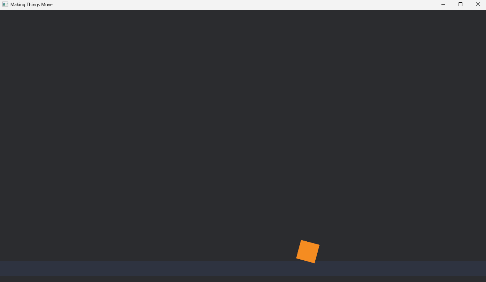

# Chapter 5 — Making Things Move

*Read this in: **English** | [Español](README.es.md)*

A game where nothing moves is a painting. In this chapter you write your first **`Update` system** — code that runs every frame — and animate the ball with it. Along the way you'll meet the three tools every gameplay system uses: **queries** (find the entities I care about), **`Time`** (how long was the last frame), and Rust's **borrow checker**, which turns out to be the reason Bevy is fast.

**Time**: ~45 minutes.

## Step 1 — Start from Chapter 4

Create the project (`cargo new moving_ball`), set up `Cargo.toml` as always, and copy Chapter 4's `main.rs` in — camera, floor, ball, `Ball` marker. That scene is our starting point.

## Step 2 — First attempt: just move it

Add a new system function at the bottom of the file:

```rust
/// Runs every frame: push the ball to the right.
fn move_ball(mut query: Query<&mut Transform, With<Ball>>) {
    for mut transform in &mut query {
        transform.translation.x += 3.0;
    }
}
```

And register it in `main()`, right after the `Startup` line:

```rust
        .add_systems(Startup, setup)
        .add_systems(Update, move_ball)
```

`Update` is the every-frame schedule: Bevy calls `move_ball` once per frame, forever. Run it — the ball slides right and exits the screen. Movement! Two problems, though, and fixing them teaches this chapter's two big lessons.

### What's a Query?

`Query<&mut Transform, With<Ball>>` is the system asking Bevy for entities, and it reads as two halves:

- **First half — what I want to access**: `&mut Transform` — "give me each entity's `Transform`, and I intend to *modify* it."
- **Second half — which entities qualify**: `With<Ball>` — "only entities that also have the `Ball` component. I don't need to read `Ball` (it's empty anyway); it just has to be there."

In spreadsheet terms: *select the `Transform` column, for rows where the `Ball` column is checked*. The camera and the floor have Transforms too — the filter is what protects them. Then `for mut transform in &mut query` loops over every match; today that's one ball, but the same system would move a thousand.

> [!NOTE]
> **Rust sidebar: `&`, `&mut`, and the borrow checker.** In Rust, `&thing` is a *reference* — permission to **read** `thing` — and `&mut thing` is permission to **modify** it. The compiler enforces one law about them: at any moment, a value can have **many readers, or exactly one writer — never both**. That's the *borrow checker*, and it eliminates whole categories of bugs (data changed under your feet, two writers colliding) at compile time.
>
> Here's the payoff for games: Bevy reads your queries as declarations of intent. A system asking for `&Transform` (read) can safely run **in parallel** with other readers; a system asking for `&mut Transform` gets exclusive access. Your game uses every CPU core, automatically, *because* the borrow rules make it provably safe. The borrow checker isn't a hurdle to get past — it's the engine's scheduler doing its job.

## Step 3 — Second attempt: respect time

The naive version has a hidden bug: `+= 3.0` per **frame** means the ball's speed depends on the frame rate. On a 60 Hz display it moves 180 pixels/second; on a 144 Hz gaming monitor, 432 — the game is more than twice as fast on your friend's machine. Real games move per **second**, not per frame:

```rust
fn move_ball(time: Res<Time>, mut query: Query<&mut Transform, With<Ball>>) {
    for mut transform in &mut query {
        transform.translation.x += 200.0 * time.delta_secs();
    }
}
```

Two changes:

- The system now also requests **`Res<Time>`** — Bevy's clock. `Res` means *resource*: global data that belongs to the whole game rather than to any entity. (Our finished game keeps the score in a resource; that story starts in Chapter 8.)
- `time.delta_secs()` is the duration of the last frame in seconds — about 0.016 at 60 FPS, about 0.007 at 144 FPS. Multiplying by it makes the math come out identical on both machines: **200 pixels per second, everywhere.**

> [!IMPORTANT]
> This is the golden rule of game movement: **anything that changes over time gets multiplied by delta time.** Every velocity, every rotation, every timer in the rest of this course does it. When gravity arrives in Chapter 9, it's delta time that makes the physics correct.

## Step 4 — Final version: back and forth, with a roll

Frame-independent — but the ball still leaves the screen. Replace `move_ball` with the version this chapter ships:

```rust
/// Runs every frame: slide the ball back and forth along the floor,
/// rolling it in the direction it travels.
fn move_ball(time: Res<Time>, mut query: Query<&mut Transform, With<Ball>>) {
    for mut transform in &mut query {
        // A smooth wave between -400 and +400 as time passes.
        let x = (time.elapsed_secs() * 0.8).sin() * 400.0;

        // How far we moved this frame decides how much the ball rolls.
        let dx = x - transform.translation.x;
        transform.translation.x = x;
        transform.rotate_z(-dx * 0.02);
    }
}
```

- `time.elapsed_secs()` is the *total* time since the game started (versus `delta_secs()`, the last frame only).
- `.sin()` turns steadily-growing time into a smooth wave that swings forever between −1 and +1; times 400, the ball patrols between x = −400 and x = +400, slowing gracefully at the edges. The `0.8` is the speed dial.
- `transform.rotate_z(...)` spins the sprite (in radians). We rotate by how far the ball moved this frame, so it *rolls* like a ball instead of sliding like a crate — and rolls the other way when it turns around.

```
cargo run
```



The ball patrols the court, rolling as it goes, reversing with a natural ease-in-ease-out. That's a sine wave doing animation work for free.

## Experiments before you move on

1. Speed it up: change `0.8` to `3.0`. Widen the patrol: `400.0` to `600.0`.
2. Delete `With<Ball>` from the query and run it. The *floor* patrols too — and so does the camera, which is disorienting and wonderful. Filters matter. Put it back.
3. Make the roll backwards: remove the minus sign in `rotate_z`. It now moonwalks — your eye catches it immediately.
4. Add a second ball at a different starting x (Chapter 4 experiment). Both move — one system, every matching entity.

## What you built / What's next

A living scene: your first every-frame system, driven by a query that picks exactly the right entities and math that runs at the same speed on every machine.

Your code should now match this chapter's folder: [`chapters/05-making-things-move/`](.).

In **Chapter 6**, this window learns a new trick: running inside a browser. WebAssembly, Trunk, and your Chapter 1 toolchain finally meet.

**[Continue to Chapter 6: Running in the browser →](../06-running-in-the-browser/README.md)**
