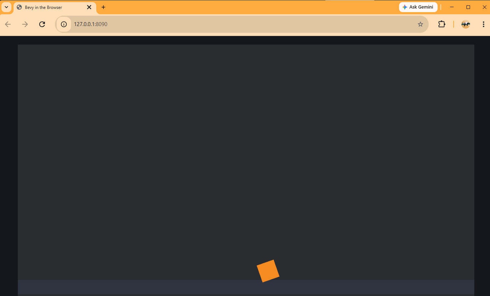

# Chapter 6 — Running in the Browser

*Read this in: **English** | [Español](README.es.md)*

This is the payoff chapter for your Chapter 1 toolchain. The rolling ball from Chapter 5 — the exact same Rust code — is about to run inside Chrome, Firefox, or any modern browser, with **zero changes to the game logic**. Along the way you'll learn what WebAssembly actually is, what `index.html` does in a Rust project, and the two classic failure modes of this pipeline.

**Time**: ~45 minutes, plus one WASM first-build.

## What WebAssembly actually is

Browsers historically ran only JavaScript. **WebAssembly (WASM)** is the second thing they can run: a compact binary instruction format that executes at near-native speed, inside the same security sandbox as everything else on a web page. It isn't a language you write — it's a *compile target*, like "Windows" or "macOS" are compile targets. Rust is one of the languages that compiles to it best.

For us it means: one codebase, and anyone with a browser can play your game — no installer, no "works on Windows only", no app store. This is how the basketball game you saw in Chapter 0 ships.

## Step 1 — The project (no new game code!)

Create `browser_ball`, set up `Cargo.toml` as always, and copy in Chapter 5's `main.rs` unchanged (you can update the window title string to `"Bevy in the Browser"` — that's cosmetic). This is the point of the chapter: **the game code doesn't know or care that it's going to the web.**

## Step 2 — One new dependency rule

Add this block to `Cargo.toml`:

```toml
# WASM-only: pin wasm-bindgen to the exact version Bevy already locks,
# so Trunk's wasm-bindgen-cli matches the bindings our build generates.
[target.'cfg(target_arch = "wasm32")'.dependencies]
wasm-bindgen = "=0.2.122"
```

Two new ideas in five lines:

- **Target-specific dependencies.** The `[target.'cfg(target_arch = "wasm32")']` header means: this dependency only exists when compiling for WebAssembly. Native builds ignore it completely.
- **wasm-bindgen** is the bridge between the WASM world and the browser world. Compiled WASM can't touch the page, the canvas, or input events by itself — `wasm-bindgen` generates the JavaScript glue that connects them. It has two halves that *must match exactly*: a library compiled into your game, and a command-line tool (run by Trunk) that generates the glue. The `=` in `"=0.2.122"` means *exactly* this version, not "0.2.122 or newer" — that's what keeps the two halves in sync.

> [!WARNING]
> **The error when the halves don't match.** If your locked `wasm-bindgen` crate and the CLI tool disagree, the build (or the page) fails with a message like:
>
> ```
> it looks like the Rust project used to create this wasm file was linked against
> version of wasm-bindgen that uses a different bindgen format than this binary
> ```
>
> The fix is what we just did: pin `wasm-bindgen` with an exact `=` version that matches what Bevy's ecosystem expects. This pin exists in the real basketball game's `Cargo.toml` for exactly this reason.

## Step 3 — index.html: the web host

Create `index.html` in the project root — **next to** `Cargo.toml`, not inside `src/`:

```html
<!DOCTYPE html>
<html lang="en">
  <head>
    <meta charset="utf-8" />
    <title>Bevy in the Browser</title>
    <!-- This one line tells Trunk: compile this folder's Rust to WASM
         and wire it into the page. -->
    <link data-trunk rel="rust" />
    <style>
      html,
      body {
        margin: 0;
        padding: 0;
        background: #16161d;
      }
      /* Bevy creates a <canvas> and draws the game into it. */
      canvas {
        display: block;
        margin: 24px auto 0;
        outline: none;
      }
    </style>
  </head>
  <body></body>
</html>
```

This file is both the web page your game lives in *and* Trunk's configuration. The magic line is `<link data-trunk rel="rust" />` — it tells Trunk "the Rust project in this folder is the payload." When the game boots, Bevy creates a `<canvas>` element (its window, web edition) and draws every frame into it; the CSS centers that canvas on a dark page. There's no `<script>` tag because Trunk injects the generated glue for you.

## Step 4 — trunk serve

```
trunk serve
```

Here's the pipeline Trunk runs for you — this is your whole Chapter 1 toolchain firing in sequence:

1. `cargo build --target wasm32-unknown-unknown` — the Rust compiler produces a `.wasm` file instead of an `.exe` (this is why you installed that target),
2. `wasm-bindgen` generates the JavaScript glue,
3. everything is bundled with your `index.html` into a `dist/` folder,
4. a local web server starts, and rebuilds + reloads the page whenever you save a file.

The first WASM build compiles the whole dependency tree again for the new target — on our machine it took **3 minutes 33 seconds**. One-time cost, same as Chapter 3. Then:

```
INFO 📡 serving static assets at -> /
INFO 🏠 server listening at:
INFO     🏠 http://127.0.0.1:8080/
```

Open **<http://127.0.0.1:8080>** in your browser:



The same ball, rolling back and forth on the same floor — inside a web page. The game is compiled Rust, running at full speed in the browser's sandbox, redrawn by your GPU through WebGL.

> [!WARNING]
> **`error: error binding to 127.0.0.1:8080 ... Address already in use`** — something else on your machine already owns port 8080 (very often: another `trunk serve` you forgot in a different terminal). This happened to us during the original build. Either close the other program, or pick another port: `trunk serve --port 8081`. This error looks scary and means almost nothing.

> [!TIP]
> Leave `trunk serve` running and change something — the ball's color, the wave speed — and save. Trunk recompiles (seconds, thanks to Chapter 3's profile trick) and the browser reloads itself. This edit-save-see loop is how the rest of the course is meant to be experienced.

## Native and web, side by side

Nothing about the desktop version broke: `cargo run` in this same folder still opens the native window. One codebase, two platforms — for the rest of the course we develop in the browser via `trunk serve`, because that's where the finished game lives, but every chapter still runs natively too.

A note on expectations: this dev-mode `.wasm` file is big (tens of MB) and unoptimized. Shipping a small, fast web build is a real engineering topic — and it's exactly what Chapter 14 is about.

## What you built / What's next

Your game runs on the web. More importantly, you understand each moving part: the `wasm32` target produces the binary, `wasm-bindgen` bridges it to the browser (with an exact-version handshake), `index.html` hosts it, and Trunk conducts the orchestra.

Your code should now match this chapter's folder: [`chapters/06-running-in-the-browser/`](.).

**Part II is complete.** In **Chapter 7** we start building the real game: the court, the backboard, the hoop — drawn with real shapes instead of squares, and organized with constants like an engineer would.

**[Continue to Chapter 7: The court →](../07-the-court/README.md)**
