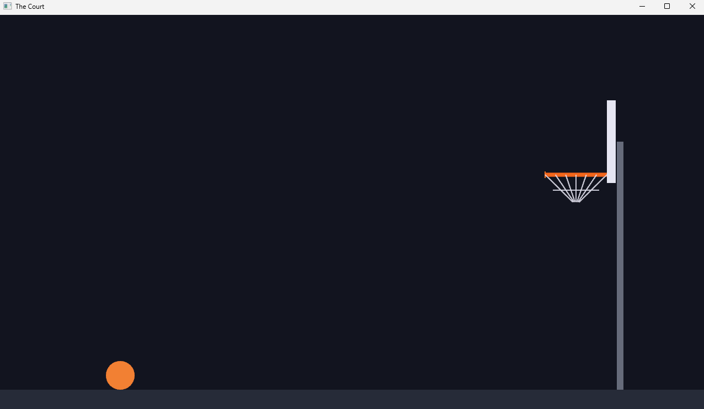

# Chapter 7 — The Court

*Read this in: **English** | [Español](README.es.md)*

**Part III starts here.** No more demo scenes — from this chapter until the end of the course, every line of code you write is a line of the actual basketball game. Today you build the world it happens in: the court, the backboard, the rim, the net — and you organize it the way an engineer would, with every measurement in one named place.

**Time**: ~1 hour.

## Step 1 — The court, in numbers

Create the project (`the_court`), with the `Cargo.toml` from Chapter 6 (Bevy, the wasm-bindgen pin, the profiles) and its `index.html` (update the `<title>`). Then start `main.rs` with something new — a block of *constants* before any code:

```rust
use bevy::{prelude::*, render::camera::ScalingMode};

// ---------- The court, in numbers ----------

// Fixed play area so the whole court stays visible at any window/canvas size.
const WORLD_W: f32 = 1280.0;
const WORLD_H: f32 = 720.0;

const BALL_R: f32 = 26.0;
const GROUND_Y: f32 = -320.0;
// The ball starts at the free-throw spot, resting on the floor.
const START: Vec2 = Vec2::new(-420.0, GROUND_Y + BALL_R);

const BACKBOARD_X: f32 = 470.0;
const BACKBOARD_Y: f32 = 130.0;
const BACKBOARD_W: f32 = 16.0;
const BACKBOARD_H: f32 = 150.0;
const BACKBOARD_FRONT: f32 = BACKBOARD_X - BACKBOARD_W / 2.0;

const RIM_Y: f32 = 70.0;
const RIM_FRONT_X: f32 = 350.0;
const RIM_BACK_X: f32 = BACKBOARD_FRONT;
```

These are the *real* numbers from the finished game, and they'll never change again for the rest of the course. Read them like a blueprint against the Chapter 4 coordinate system: the floor line sits at y = −320; the ball (radius 26) starts on the left at the free-throw spot; the backboard is a 16×150 slab on the right; the rim hangs at y = 70, spanning from x = 350 to the backboard's front face.

Why constants instead of typing `470.0` where it's needed? Three engineering reasons:

1. **Names carry meaning.** `BACKBOARD_FRONT` tells you what a number *is*; a bare `462.0` doesn't.
2. **One source of truth.** When physics (Chapter 9) needs to bounce the ball off the backboard's front face, it uses `BACKBOARD_FRONT` — the drawing code and the collision code can never disagree.
3. **Derived values stay correct.** `BACKBOARD_FRONT` is *computed* (`BACKBOARD_X - BACKBOARD_W / 2.0`), and `RIM_BACK_X` equals it — so the net always meets the backboard, even if you move the hoop. Try changing `BACKBOARD_X` at the end of the chapter and watch everything follow.

> [!NOTE]
> **Rust sidebar: `const`.** A `const` is a value fixed at compile time: the type is required (`: f32`), the name is `SCREAMING_SNAKE_CASE` by convention, and unlike `let` it can live outside any function, visible to the whole file. Simple math is allowed in them — that's what makes derived constants like `BACKBOARD_FRONT` possible.

## Step 2 — A camera that always shows the whole court

Two upgrades to `main()`. First, the background color becomes a *resource*:

```rust
        .insert_resource(ClearColor(Color::srgb(0.07, 0.08, 0.12)))
```

You met `Res<Time>` in Chapter 5; now you're *creating* a resource. A resource is global data the whole game shares — exactly one of it exists. `ClearColor` is Bevy's "paint the screen this color before drawing each frame." Score and game state will be resources too, starting next chapter.

Second, the camera gets a projection:

```rust
    commands.spawn((
        Camera2d,
        Projection::from(OrthographicProjection {
            scaling_mode: ScalingMode::AutoMin {
                min_width: WORLD_W,
                min_height: WORLD_H,
            },
            ..OrthographicProjection::default_2d()
        }),
    ));
```

Until now, resizing the window showed *more or less world*. For a game that's wrong — a player with a huge monitor would see beyond the court. `ScalingMode::AutoMin` changes the rule: **the camera always shows at least 1280×720 of world**, scaled to fit. Resize the window however you like — shrink it, stretch it wide — the whole court stays visible. In the browser (where the canvas can be any size) this is what keeps the game playable everywhere.

## Step 3 — The ball becomes a circle

Squares were fine for learning; basketballs are round. Drawing *shapes* (not rectangular sprites) introduces one last rendering concept:

```rust
fn setup(
    mut commands: Commands,
    mut meshes: ResMut<Assets<Mesh>>,
    mut materials: ResMut<Assets<ColorMaterial>>,
) {
    // ...camera...

    // The ball: a real circle at last. In front (z = 1) so it draws
    // over the rim and backboard.
    commands.spawn((
        Ball,
        Mesh2d(meshes.add(Circle::new(BALL_R))),
        MeshMaterial2d(materials.add(Color::srgb(0.95, 0.5, 0.2))),
        Transform::from_translation(START.extend(1.0)),
    ));
```

- A **mesh** is a shape (here, a circle built from triangles — all GPU drawing is triangles). A **material** is how its surface looks (here, flat basketball orange).
- Meshes and materials live in Bevy's **asset storage** — that's the `ResMut<Assets<Mesh>>` parameter, another resource, this time borrowed mutably because we're adding to it.
- `meshes.add(...)` stores the shape and returns a **handle** — a lightweight ticket that points to the real data. The entity carries the ticket, not the shape. If we later spawned a hundred balls, they'd share one mesh through a hundred cheap handles.
- `START.extend(1.0)` turns the 2D point into 3D by appending z = 1.0 — our "ball draws in front" layer from Chapter 4.

## Step 4 — Backboard, pole, rim, floor

The rest of `setup` is four sprites, every position derived from the constants:

```rust
    // The floor: extra wide so it never shows an edge on wide screens.
    commands.spawn((
        Sprite::from_color(Color::srgb(0.15, 0.17, 0.22), Vec2::new(WORLD_W * 2.0, 60.0)),
        Transform::from_xyz(0.0, GROUND_Y - 30.0, -1.0),
    ));

    // Support pole behind the hoop.
    commands.spawn((
        Sprite::from_color(
            Color::srgb(0.4, 0.42, 0.48),
            Vec2::new(12.0, BACKBOARD_Y - GROUND_Y),
        ),
        Transform::from_xyz(BACKBOARD_X + 16.0, (BACKBOARD_Y + GROUND_Y) / 2.0, -1.0),
    ));

    // The backboard.
    commands.spawn((
        Sprite::from_color(
            Color::srgb(0.9, 0.9, 0.95),
            Vec2::new(BACKBOARD_W, BACKBOARD_H),
        ),
        Transform::from_xyz(BACKBOARD_X, BACKBOARD_Y, 0.0),
    ));

    // Solid rim bar across the hoop opening (drawn behind the ball).
    commands.spawn((
        Sprite::from_color(
            Color::srgb(0.95, 0.4, 0.1),
            Vec2::new(RIM_BACK_X - RIM_FRONT_X, 7.0),
        ),
        Transform::from_xyz((RIM_FRONT_X + RIM_BACK_X) / 2.0, RIM_Y, 0.5),
    ));
}
```

Notice the reading level you've reached: the pole's height is `BACKBOARD_Y - GROUND_Y` (from the floor to the backboard), centered at their midpoint; the rim bar's width is `RIM_BACK_X - RIM_FRONT_X`, centered between them. The z values stack the scene: floor and pole behind (−1), backboard at 0, rim in front of it (0.5), ball in front of everything (1).

## Step 5 — The net, drawn with Gizmos

Sprites and meshes are *retained*: spawn once, they persist. **Gizmos** are the opposite — immediate-mode lines that vanish every frame and must be redrawn. Perfect for things that change constantly (next chapter they draw the aim trajectory and power bar). The net is our practice run:

```rust
/// Gizmos are redrawn from scratch every frame, so this runs in Update.
fn draw_net(mut gizmos: Gizmos) {
    let orange = Color::srgb(0.95, 0.45, 0.15);
    let net = Color::srgba(0.85, 0.85, 0.9, 0.85);

    // Front rim nub so the front edge of the hoop opening is obvious.
    gizmos.line_2d(
        Vec2::new(RIM_FRONT_X, RIM_Y - 6.0),
        Vec2::new(RIM_FRONT_X, RIM_Y + 6.0),
        orange,
    );

    // Net: angled strands from the rim opening converging to a point below.
    let bottom = Vec2::new((RIM_FRONT_X + RIM_BACK_X) / 2.0, RIM_Y - 55.0);
    let segs = 6;
    for i in 0..=segs {
        let t = i as f32 / segs as f32;
        let top = Vec2::new(RIM_FRONT_X + (RIM_BACK_X - RIM_FRONT_X) * t, RIM_Y);
        gizmos.line_2d(top, top.lerp(bottom, 0.9), net);
    }
    // One horizontal strand so the net reads as woven, not just lines.
    gizmos.line_2d(
        Vec2::new(RIM_FRONT_X + 14.0, RIM_Y - 28.0),
        Vec2::new(RIM_BACK_X - 14.0, RIM_Y - 28.0),
        net,
    );
}
```

Register it with `.add_systems(Update, draw_net)`. The loop hangs seven strands evenly across the rim opening: `t` walks from 0.0 to 1.0, placing each strand's top, and `lerp` (linear interpolation — "walk this fraction of the way toward that point") angles them toward a gathering point below. Seven lines of math that read like a description of a net.

## Run it

```
cargo run        (or: trunk serve)
```



That's the court from Chapter 0's screenshot — because it *is* the finished game's court, drawn by the finished game's code.

## Experiments before you move on

1. Lower the rim for dunking practice: `RIM_Y` to `-50.0`. Net, nub, and rim bar all follow — one constant, whole hoop.
2. Move the hoop closer: `BACKBOARD_X` to `300.0`. Watch `BACKBOARD_FRONT` and `RIM_BACK_X` ripple after it.
3. Make the net longer: the `-55.0` in `bottom` to `-100.0`.
4. Resize the window aggressively while it runs — the whole court stays framed. That's `AutoMin` working.

## What you built / What's next

The stage for the whole game — built from real shapes, layered with z, always in frame at any window size, and specified by one block of named numbers that the physics chapters will reuse verbatim.

Your code should now match this chapter's folder: [`chapters/07-the-court/`](.).

In **Chapter 8**, the ball answers to you: mouse input, the hold-to-charge power meter, the aim trajectory — and game state managed in resources.

**[Continue to Chapter 8: The shooting mechanic →](../08-the-shooting-mechanic/README.md)**
