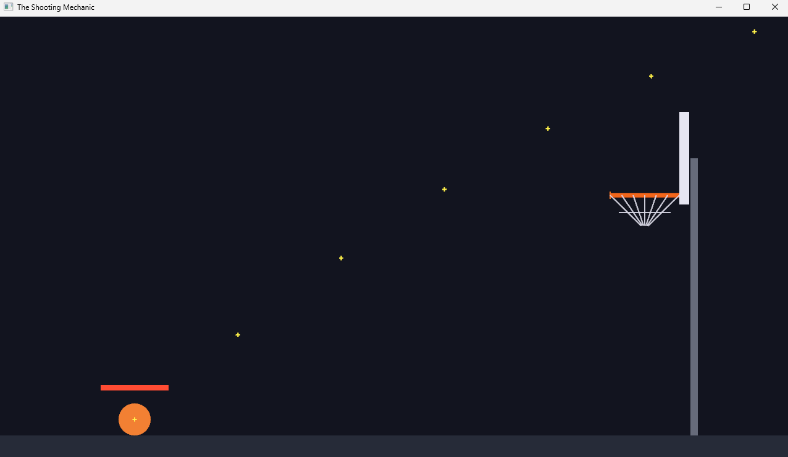
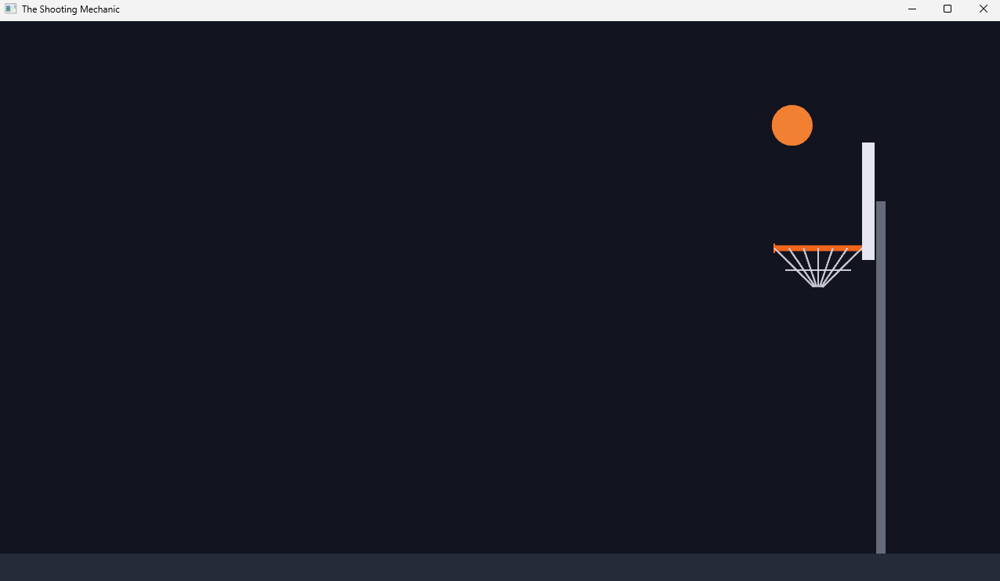

# Chapter 8 — The Shooting Mechanic

*Read this in: **English** | [Español](README.es.md)*

The game becomes a game: in this chapter you read the mouse, charge a shot by holding, aim with the cursor, preview the arc with a dotted trajectory, and launch the ball with real gravity. This is the largest chapter so far and it earns it — input handling, enums, `Option`, and system ordering all arrive here, exactly as the finished game uses them.

**Time**: ~1.5 hours.

## Step 1 — New constants: the "game feel" block

Start from Chapter 7's code (project `shooting_mechanic`, same `Cargo.toml` and `index.html`). Add a second constants block right after the court:

```rust
// ---------- Game feel — tweak these to change difficulty ----------

const GRAVITY: f32 = -1300.0; // downward acceleration in px/s^2
const CHARGE_TIME: f32 = 1.2; // seconds of holding to reach full power
const MIN_SHOT_SPEED: f32 = 500.0; // launch speed at zero charge
const MAX_SHOT_SPEED: f32 = 2200.0; // launch speed at full charge
```

These four numbers *are* the game's difficulty. Gravity is negative because +y is up; 1.2 seconds to full charge makes power a skill, not a click; the speed range decides whether a lazy tap dribbles forward or a full hold rockets across the court. At the end of the chapter, tweak them and feel the game change.

## Step 2 — The ball gets real data

In Chapter 4, `Ball` was an empty marker. Now it carries state:

```rust
/// The ball is either resting (shootable) or in the air.
#[derive(PartialEq)]
enum BallState {
    Idle,
    Flying,
}

#[derive(Component)]
struct Ball {
    velocity: Vec2,
    state: BallState,
    // Position before this frame's move — scoring will need it in Chapter 10.
    prev_pos: Vec2,
}
```

And the spawn in `setup` fills it in:

```rust
        Ball {
            velocity: Vec2::ZERO,
            state: BallState::Idle,
            prev_pos: START,
        },
```

> [!NOTE]
> **Rust sidebar: enums.** An `enum` is a type whose value is exactly one of a fixed list of named *variants* — here, a ball is `Idle` or `Flying`, never both, never neither. We could have used a boolean (`is_flying`), but the enum *names the concept*: code reading `ball.state == BallState::Idle` explains itself. The `#[derive(PartialEq)]` gives us that `==` comparison for free — like `Component` in Chapter 4, it's a derived trait. Rust's enums are one of the language's best features (they can even carry data inside each variant), and Bevy code leans on them everywhere.

One more piece of state — the charge — belongs to *the game*, not to any entity. That makes it a resource:

```rust
// While aiming: how long the mouse has been held (the charge), capped at CHARGE_TIME.
#[derive(Resource, Default)]
struct Aim {
    active: bool,
    charge: f32,
}
```

Register it in `main()` with `.init_resource::<Aim>()` — "create this resource using its `Default` (all zeros/false)." That's the second derive: `Default` writes the "empty" constructor for you.

## Step 3 — Where is the mouse, in *world* coordinates?

The window reports the cursor in **screen pixels** (origin top-left, y down). Our game lives in **world coordinates** (origin center, y up, and — since Chapter 7's `AutoMin` camera — possibly scaled). The camera knows how to convert:

```rust
/// Where is the mouse cursor, in world coordinates?
fn cursor_world(
    windows: &Query<&Window>,
    cameras: &Query<(&Camera, &GlobalTransform)>,
) -> Option<Vec2> {
    let window = windows.single().ok()?;
    let (camera, cam_tf) = cameras.single().ok()?;
    let cursor = window.cursor_position()?;
    camera.viewport_to_world_2d(cam_tf, cursor).ok()
}
```

Note this is a helper function, not a system — systems will call it. And its return type introduces a Rust celebrity:

> [!NOTE]
> **Rust sidebar: `Option` and the `?` operator.** Many values can legitimately *not exist*: the cursor position (the mouse may be outside the window), the window itself (it might be closing). Rust has no `null` — instead, "maybe a value" is its own type: `Option<Vec2>` is either `Some(position)` or `None`, and the compiler forces whoever receives it to handle both cases. **You cannot forget the null check in Rust — it doesn't compile.**
>
> The `?` after each call is the early-exit operator: "if this was `None`, stop here and return `None`; otherwise unwrap and continue." Four fallible steps read as a straight line. (`.ok()` converts `Result` — a cousin of `Option` for operations that report errors — into an `Option` so `?` works uniformly.)

A second helper turns cursor position into launch direction:

```rust
// Launch goes from the ball toward the cursor; if the cursor is on the ball, default up-right.
fn aim_dir(ball: Vec2, cursor: Vec2) -> Vec2 {
    let d = cursor - ball;
    if d.length() < 1.0 {
        Vec2::new(0.7, 0.7).normalize()
    } else {
        d.normalize()
    }
}
```

`normalize()` shrinks a vector to length 1 — pure direction, no magnitude. Direction and power stay independent: the cursor aims, the charge decides speed.

## Step 4 — The heart: `aim_and_launch`

One system implements the whole mechanic. Read the shape first, details after:

```rust
fn aim_and_launch(
    time: Res<Time>,
    mouse: Res<ButtonInput<MouseButton>>,
    keys: Res<ButtonInput<KeyCode>>,
    windows: Query<&Window>,
    cameras: Query<(&Camera, &GlobalTransform)>,
    mut aim: ResMut<Aim>,
    mut balls: Query<(&mut Ball, &mut Transform)>,
    mut gizmos: Gizmos,
) {
    let Ok((mut ball, mut tf)) = balls.single_mut() else {
        return;
    };

    // R re-spots the ball at the start line.
    if keys.just_pressed(KeyCode::KeyR) {
        reset(&mut ball, &mut tf);
        aim.active = false;
        aim.charge = 0.0;
        return;
    }

    let ball_pos = tf.translation.truncate();
    let Some(cursor) = cursor_world(&windows, &cameras) else {
        return;
    };

    if mouse.just_pressed(MouseButton::Left) && ball.state == BallState::Idle {
        aim.active = true;
        aim.charge = 0.0;
    }
    if !aim.active {
        return;
    }

    if mouse.pressed(MouseButton::Left) {
        aim.charge = (aim.charge + time.delta_secs()).min(CHARGE_TIME);
        let power = aim.charge / CHARGE_TIME;
        let speed = MIN_SHOT_SPEED + (MAX_SHOT_SPEED - MIN_SHOT_SPEED) * power;
        let launch = aim_dir(ball_pos, cursor) * speed;
        draw_power_bar(&mut gizmos, ball_pos, power);
        draw_trajectory(&mut gizmos, ball_pos, launch);
    }

    if mouse.just_released(MouseButton::Left) {
        let power = aim.charge / CHARGE_TIME;
        let speed = MIN_SHOT_SPEED + (MAX_SHOT_SPEED - MIN_SHOT_SPEED) * power;
        ball.velocity = aim_dir(ball_pos, cursor) * speed;
        ball.state = BallState::Flying;
        ball.prev_pos = ball_pos;
        aim.active = false;
        aim.charge = 0.0;
    }
}
```

The input API is a three-phase model, and it's the key to the whole mechanic:

| Method | True... | Used for |
|---|---|---|
| `just_pressed` | only the frame the button went down | *starting* the charge |
| `pressed` | every frame while held | *building* the charge, drawing the preview |
| `just_released` | only the frame it came up | *firing* the shot |

Follow one shot through: press on an `Idle` ball → `aim.active`, charge zeroed. Each held frame → charge grows by delta time (capped at `CHARGE_TIME`), and `power` (0.0–1.0) sets the launch speed by linear interpolation between min and max. Release → the ball's `velocity` becomes direction × speed, its state flips to `Flying`, the aim resets. Eight lines of *mechanism*, driven entirely by the constants block.

Also new here: `let Ok(...) = ... else { return; }` and `let Some(...) = ... else { return; }` — the *let-else* pattern, "unpack this or bail out," Rust's tidy way to guard a function. And `truncate()` drops z from the 3D translation: physics thinks in 2D.

The `reset` helper re-spots the ball:

```rust
fn reset(ball: &mut Ball, tf: &mut Transform) {
    ball.velocity = Vec2::ZERO;
    ball.state = BallState::Idle;
    ball.prev_pos = START;
    tf.translation = START.extend(1.0);
}
```

## Step 5 — The preview: power bar and trajectory

Both are gizmos — redrawn only on frames where you're actually charging:

```rust
// A power meter above the ball that fills and shifts green -> red as it charges.
fn draw_power_bar(gizmos: &mut Gizmos, ball_pos: Vec2, power: f32) {
    let w = 110.0;
    let base = ball_pos + Vec2::new(-w / 2.0, BALL_R + 22.0);
    let bg = Color::srgba(1.0, 1.0, 1.0, 0.25);
    let fill = Color::srgb(0.2 + 0.8 * power, 1.0 - 0.7 * power, 0.2);
    for o in 0..8 {
        let y = o as f32;
        gizmos.line_2d(base + Vec2::new(0.0, y), base + Vec2::new(w, y), bg);
        gizmos.line_2d(base + Vec2::new(0.0, y), base + Vec2::new(w * power, y), fill);
    }
}

// A small "+" so the predicted path reads as distinct dots, not a faint line.
fn dot(gizmos: &mut Gizmos, p: Vec2, color: Color) {
    gizmos.line_2d(p - Vec2::X * 3.5, p + Vec2::X * 3.5, color);
    gizmos.line_2d(p - Vec2::Y * 3.5, p + Vec2::Y * 3.5, color);
}

fn draw_trajectory(gizmos: &mut Gizmos, start: Vec2, vel: Vec2) {
    let dt = 1.0 / 60.0;
    let mut p = start;
    let mut v = vel;
    let color = Color::srgba(1.0, 0.95, 0.3, 0.95);
    for i in 0..150 {
        if i % 6 == 0 {
            dot(gizmos, p, color);
        }
        p += v * dt;
        v.y += GRAVITY * dt;
        if p.y < GROUND_Y + BALL_R {
            break;
        }
    }
}
```

The power bar is eight stacked lines (gizmos have no thickness, so we fake it), with the fill color sliding from green to red as `power` rises. The trajectory is the clever one: it **runs the flight physics ahead of time** — same gravity, same time step — plotting every sixth position as a `+`. The preview never lies, because it's the same math the real flight uses. Which is…

## Step 6 — Gravity

```rust
/// Gravity pulls the velocity down; the velocity moves the ball.
fn physics(time: Res<Time>, mut balls: Query<(&mut Ball, &mut Transform)>) {
    let dt = time.delta_secs();
    for (mut ball, mut tf) in &mut balls {
        if ball.state != BallState::Flying {
            continue;
        }
        ball.prev_pos = tf.translation.truncate();
        ball.velocity.y += GRAVITY * dt;
        let step = ball.velocity * dt;
        tf.translation.x += step.x;
        tf.translation.y += step.y;
    }
}
```

Two lines of physics, worth reading aloud: **gravity changes the velocity; the velocity changes the position** — each scaled by delta time (Chapter 5's golden rule). That's projectile motion, the same math as the moon and cannonballs. Everything else is bookkeeping: only `Flying` balls move, and `prev_pos` remembers where the ball was (Chapter 10 will need it to detect the rim crossing).

Register both systems with an ordering guarantee:

```rust
        .add_systems(Update, (aim_and_launch, physics).chain())
```

`.chain()` means "run these in this exact order." Without it, Bevy may run them in parallel or in any order (that's the borrow-checker superpower from Chapter 5) — but a launch must be *seen* by physics in the same frame, so here, order matters.

## Run it

```
trunk serve        (or: cargo run)
```

Hold the mouse on the ball, drag toward the hoop, watch the bar fill and the arc extend:



Release:



And then… the ball clips through the rim, through the floor, and falls out of the world forever. (Press **R**.) Nothing in the world pushes back yet — the backboard is a picture, the floor is a picture. **Making them solid is Chapter 9.**

## Experiments before you move on

1. `CHARGE_TIME` to `0.3` — a twitchy arcade shot. To `3.0` — a golf swing.
2. `GRAVITY` to `-300.0` — moon basketball. The trajectory preview adjusts automatically (same math!).
3. Hold a shot and wiggle the cursor: direction updates live while charging, exactly as `aim_dir` promises.

## What you built / What's next

A complete, tunable shooting mechanic: three-phase input, charge as a resource, screen-to-world conversion, an honest trajectory preview, and gravity — the same code, line for line, as the finished game.

Your code should now match this chapter's folder: [`chapters/08-the-shooting-mechanic/`](.).

In **Chapter 9**, the world becomes solid: the floor bounces, the backboard banks, the rim rejects — collision detection, reflection, restitution, and friction.

**[Continue to Chapter 9: Physics →](../09-physics/README.md)**
