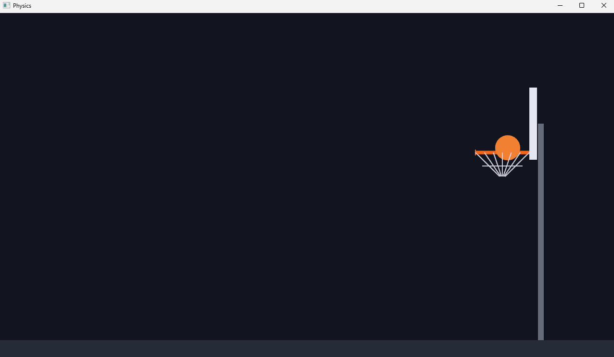

# Chapter 9 — Physics: The World Pushes Back

*Read this in: **English** | [Español](README.es.md)*

At the end of Chapter 8, your ball flew a perfect gravity arc — straight through the rim, through the floor, and out of existence. In this chapter the court becomes *solid*: the backboard banks, the rim rejects near-misses, the walls contain, and the floor bounces, then rolls, then brings the ball to rest — ready for your next shot. This closes the gameplay loop: shoot, watch, recover, shoot again.

**Time**: ~1 hour.

## The idea: move first, then fix it

Our collision approach is the one most 2D games actually use:

1. `physics` moves the ball as if nothing were in the way (Chapter 8).
2. `collisions` runs *right after* and checks: did the ball end up inside something? If so, **push it back out** and **change its velocity** to what a bounce would have produced.

That's why the system chain grows by one link, and why the order is law:

```rust
        .add_systems(Update, (aim_and_launch, physics, collisions).chain())
```

## Step 1 — Five new constants: the material properties

```rust
const RESTITUTION: f32 = 0.6; // fraction of speed kept after a bounce
const GROUND_FRICTION: f32 = 0.75; // horizontal loss on each hard floor bounce
const ROLL_FRICTION: f32 = 2.5; // per-second slowdown while rolling on the floor
const BOUNCE_THRESHOLD: f32 = 160.0; // |vy| above this = real bounce, below = rest/roll
const STOP_SPEED: f32 = 30.0; // ball fully stops below this horizontal speed
```

If Chapter 8's constants were the game's *difficulty*, these are its *materials*. `RESTITUTION` is the classic physics term: a ball that keeps 60% of its speed per bounce feels like leather on hardwood; 95% is a superball; 10% is a beanbag. The other four govern the floor's special behavior — you'll see each one do its job below.

## Step 2 — The collision system, wall by wall

This is the biggest single function of the course. Read it in its five sections:

```rust
/// The world pushes back: bank off the backboard, bounce off the rim,
/// stay inside the walls, and bounce / roll / rest on the floor.
fn collisions(time: Res<Time>, mut balls: Query<(&mut Ball, &mut Transform)>) {
    let dt = time.delta_secs();
    let half_w = WORLD_W / 2.0;
    let half_h = WORLD_H / 2.0;

    for (mut ball, mut tf) in &mut balls {
        if ball.state != BallState::Flying {
            continue;
        }
        let mut pos = tf.translation.truncate();
```

We copy the position into a local `pos`, correct it freely, and write it back once at the end — simpler than poking at `tf.translation` five times.

### The backboard: a directional wall

```rust
        // Bank off the front face of the backboard.
        if ball.velocity.x > 0.0
            && pos.x + BALL_R > BACKBOARD_FRONT
            && pos.x < BACKBOARD_X
            && pos.y < BACKBOARD_Y + BACKBOARD_H / 2.0
            && pos.y > BACKBOARD_Y - BACKBOARD_H / 2.0
        {
            pos.x = BACKBOARD_FRONT - BALL_R;
            ball.velocity.x = -ball.velocity.x * RESTITUTION;
        }
```

Five conditions, each earning its place: the ball is moving rightward (`velocity.x > 0.0` — you can't hit the *front* of a board while moving away from it), its right edge has crossed the board's front face, it hasn't tunneled past the board's center, and it's vertically within the board. The response is the pattern you'll see in every section: **snap the position out of the object, flip and dampen the velocity.** Remember `BACKBOARD_FRONT` from Chapter 7's constants — this is the moment the drawing code and the physics code provably agree on where the backboard is.

### The rim: a round obstacle

```rust
        // Bounce off the front rim lip on a near miss.
        let rim_point = Vec2::new(RIM_FRONT_X, RIM_Y);
        let to_ball = pos - rim_point;
        if to_ball.length() < BALL_R {
            let n = to_ball.normalize_or_zero();
            pos = rim_point + n * BALL_R;
            ball.velocity = reflect(ball.velocity, n) * RESTITUTION;
        }
```

The front lip of the rim is treated as a *point*. If the ball's center comes within one radius of it, they're touching. But unlike a flat wall, a round collision can push the ball in *any* direction — so the bounce needs real math:

```rust
/// Mirror a velocity across a surface normal (the classic bounce formula).
fn reflect(v: Vec2, n: Vec2) -> Vec2 {
    v - 2.0 * v.dot(n) * n
}
```

> [!NOTE]
> **Math sidebar: the reflection formula.** `n` is the *normal* — the direction from the rim point to the ball, i.e. "directly away from the surface." `v.dot(n)` (the dot product) measures how much of the velocity points *into* the surface. Subtracting that component twice flips it: incoming at an angle, outgoing at the mirrored angle — a billiard bounce. This one-liner is in every game engine ever written; now you've written it yourself. It's exactly why a ball that grazes the rim's lip deflects up and away instead of just reversing.

### Walls and ceiling: the invisible box

```rust
        // Side walls keep the ball wandering inside the court.
        if pos.x - BALL_R < -half_w {
            pos.x = -half_w + BALL_R;
            ball.velocity.x = ball.velocity.x.abs() * RESTITUTION;
        }
        if pos.x + BALL_R > half_w {
            pos.x = half_w - BALL_R;
            ball.velocity.x = -ball.velocity.x.abs() * RESTITUTION;
        }
        // Ceiling.
        if pos.y + BALL_R > half_h {
            pos.y = half_h - BALL_R;
            ball.velocity.y = -ball.velocity.y.abs() * RESTITUTION;
        }
```

One subtle piece of craft: the left wall sets velocity to `.abs()` (definitely rightward) rather than negating it. If a bug or a weird frame ever left the ball *already* overlapping the wall while moving away, negation would trap it — flipping it back into the wall forever. `abs` states the *outcome* ("you are now moving away") instead of the *operation* ("flip"). Cheap insurance, and a habit worth stealing.

### The floor: bounce, roll, rest

The floor is richer than a wall, because basketballs don't bounce forever — they bounce, then roll, then stop:

```rust
        // Floor: bounce while losing energy, then roll, then come to rest in place.
        if pos.y - BALL_R <= GROUND_Y {
            pos.y = GROUND_Y + BALL_R;
            if ball.velocity.y < -BOUNCE_THRESHOLD {
                ball.velocity.y = -ball.velocity.y * RESTITUTION;
                ball.velocity.x *= GROUND_FRICTION;
            } else {
                ball.velocity.y = 0.0;
                ball.velocity.x *= (1.0 - ROLL_FRICTION * dt).max(0.0);
                if ball.velocity.x.abs() < STOP_SPEED {
                    ball.velocity = Vec2::ZERO;
                    ball.state = BallState::Idle;
                }
            }
        }

        tf.translation.x = pos.x;
        tf.translation.y = pos.y;
    }
}
```

`BOUNCE_THRESHOLD` is the fork in the road. Falling fast (`velocity.y < -160`)? Real bounce: flip y with restitution, shave x with `GROUND_FRICTION`. Each bounce is 60% the height of the last, so the ball *naturally* crosses under the threshold after a few — and enters rolling: y pinned to zero, x decaying smoothly per second (`ROLL_FRICTION * dt` — delta time again). And when the roll drops below `STOP_SPEED`, the punchline:

**`ball.state = BallState::Idle;`**

The ball is shootable again, wherever it stopped. No reset, no respawn — the state machine from Chapter 8 just closed the loop. Shoot from where it lies, or press R to walk it back to the free-throw spot.

## Run it

```
trunk serve        (or: cargo run)
```

Shoot. The ball banks off the backboard, kisses the rim, bounces on the hardwood in shrinking hops, rolls, stops, and waits for you:



That screenshot is from the shot we fired while testing this chapter — a bank off the backboard that dropped straight through the hoop. Which exposes the one thing missing: *the game didn't notice*. No point, no celebration, nothing. The ball fell through a rim that doesn't know it's a goal.

## Experiments before you move on

1. `RESTITUTION` to `0.95` — playground superball; watch it clatter around the court for ages.
2. `BOUNCE_THRESHOLD` to `2000.0` — the ball never bounces, it just thuds and rolls. Feel how one constant changes the material.
3. `GROUND_FRICTION` to `0.99` — icy floor; rolls forever. Note which constant stops it anyway (`STOP_SPEED`).
4. Aim straight up at full power. Ceiling bounce, floor bounces in shrinking hops, roll, rest, Idle. The whole materials system in one shot.

## What you built / What's next

A complete 2D physics response system: directional walls, a circular obstacle with true reflection, and a floor with three regimes (bounce → roll → rest) — all driven by five named material constants, all agreeing with the drawing code because both read the same blueprint.

Your code should now match this chapter's folder: [`chapters/09-physics/`](.).

In **Chapter 10**, the game learns to *notice*: detecting the ball passing down through the hoop, keeping score in a resource, putting text on screen, and celebrating with a flash of green.

**[Continue to Chapter 10: Scoring and feedback →](../10-scoring-and-feedback/README.md)**
