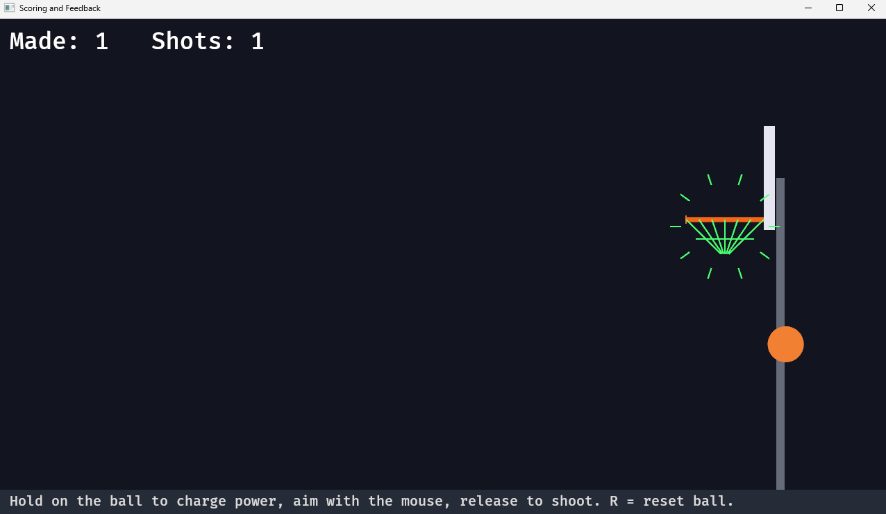

# Capítulo 10 — Puntuación y feedback

*Léelo en: [English](README.md) | **Español***

Al final del Capítulo 9 metiste una canasta y el juego se quedó… tan tranquilo. Este capítulo le da ojos y voz: detecta el frame exacto en que la pelota cae a través del aro, cuenta canastas e intentos, los muestra en un HUD en pantalla, y celebra cada swish con un destello verde y una explosión que se expande. Por el camino conocerás el sistema de UI de Bevy y un truco genuinamente de ingeniero: la detección de cambios.

**Tiempo**: ~1 hora.

## Paso 1 — Tres recursos nuevos

```rust
#[derive(Resource, Default)]
struct Score(u32);

// Total shots taken (made or missed).
#[derive(Resource, Default)]
struct Attempts(u32);

// Seconds of "swish" feedback remaining after a made basket.
#[derive(Resource, Default)]
struct ScoreFlash(f32);
```

Registra los tres en `main()` con `.init_resource::<...>()` — empiezan en cero, que es exactamente lo correcto.

> [!NOTE]
> **Sidebar de Rust: tuple structs.** `struct Score(u32);` es un *tuple struct* — un struct con un campo sin nombre, accedido como `score.0`. ¿Por qué no un `u32` a secas? Porque los recursos se buscan **por tipo**: `Res<Score>` y `Res<Attempts>` son peticiones distintas precisamente porque son tipos distintos. Dos `u32` pelados serían indistinguibles. El envoltorio *es* el nombre.

`ScoreFlash` es un patrón que merece nombre propio: **un temporizador como recurso**. Cuando se mete una canasta lo pondremos a `0.7` (segundos); un sistema pequeño lo cuenta hacia atrás; cada visual que quiera celebrar solo pregunta "¿sigue siendo positivo?" Un solo número coordina el color de la red y la animación de la explosión, sin acoplamiento directo entre los sistemas involucrados.

## Paso 2 — Detectando la canasta

La detección son cuatro líneas en `collisions`, colocadas justo después del rebote del aro — y es la recompensa de un campo que llevamos arrastrando desde el Capítulo 8:

```rust
        // Score: ball center drops through the opening. The ball is NOT reset — it
        // keeps falling through the net and bounces on, so the make is visible.
        if ball.prev_pos.y > RIM_Y
            && pos.y <= RIM_Y
            && ball.velocity.y < 0.0
            && pos.x > RIM_FRONT_X + 6.0
            && pos.x < RIM_BACK_X - 6.0
        {
            score.0 += 1;
            flash.0 = 0.7;
        }
```

(La firma del sistema gana dos parámetros: `mut score: ResMut<Score>, mut flash: ResMut<ScoreFlash>`.)

¿Por qué no simplemente "está la pelota dentro del aro"? Porque una pelota rápida se mueve muchos píxeles por frame — podría estar por encima del aro en un frame y por debajo en el siguiente, sin estar nunca *exactamente* en él. Así que detectamos el **cruce**: el frame pasado el centro estaba por encima de la línea del aro (`prev_pos.y > RIM_Y`), este frame está en ella o por debajo (`pos.y <= RIM_Y`), y está cayendo de verdad (`velocity.y < 0.0` — no se anota subiendo a través del aro). El chequeo del rango x con un margen interior de 6 píxeles exige una entrada limpia por la boca en vez de un roce por los bordes.

Esta técnica de antes/después del cruce aparece por todas partes en los juegos (vueltas, checkpoints, triggers). Es la razón por la que `physics` guarda `prev_pos` antes de cada movimiento.

También nuevo: `Attempts` se incrementa en `aim_and_launch`, justo en el momento de soltar — `attempts.0 += 1;` tras las líneas del lanzamiento. Cada suelta es un tiro, metido o fallado.

## Paso 3 — El HUD: texto de UI de Bevy

Dos spawns nuevos al final de `setup`:

```rust
    // The HUD: score in the top-left corner. UI positions are in screen
    // pixels from the window's top-left, not world coordinates.
    commands.spawn((
        Text::new("Made: 0   Shots: 0"),
        TextFont {
            font_size: 34.0,
            ..default()
        },
        TextColor(Color::WHITE),
        Node {
            position_type: PositionType::Absolute,
            top: Val::Px(12.0),
            left: Val::Px(16.0),
            ..default()
        },
        ScoreText,
    ));

    // How-to-play line at the bottom of the screen.
    commands.spawn((
        Text::new("Hold on the ball to charge power, aim with the mouse, release to shoot. R = reset ball."),
        TextFont {
            font_size: 20.0,
            ..default()
        },
        TextColor(Color::srgba(1.0, 1.0, 1.0, 0.7)),
        Node {
            position_type: PositionType::Absolute,
            bottom: Val::Px(12.0),
            left: Val::Px(16.0),
            ..default()
        },
    ));
```

Todo esto siguen siendo entidades y componentes — pero estos componentes colocan la entidad en **espacio de UI**, no en espacio de mundo. Un `Node` se posiciona en *píxeles de pantalla desde la esquina superior izquierda de la ventana* (estilo CSS, y sí — `top` en vez de nuestra habitual y-hacia-arriba), así que el HUD queda pegado a la esquina sin importar cómo escale la cámara la cancha. `Text`, `TextFont` y `TextColor` hacen lo que dicen.

El texto del marcador también recibe un componente marcador — el mismo truco que `Ball` en el Capítulo 4:

```rust
/// Marker for the HUD text entity so update_score_text can find it.
#[derive(Component)]
struct ScoreText;
```

## Paso 4 — Actualizando el HUD (solo cuando algo cambió)

```rust
/// Rewrite the HUD only on frames where the numbers actually changed.
fn update_score_text(
    score: Res<Score>,
    attempts: Res<Attempts>,
    mut q: Query<&mut Text, With<ScoreText>>,
) {
    if !score.is_changed() && !attempts.is_changed() {
        return;
    }
    if let Ok(mut text) = q.single_mut() {
        text.0 = format!("Made: {}   Shots: {}", score.0, attempts.0);
    }
}
```

La versión ingenua reconstruiría la cadena cada frame — 60 asignaciones por segundo para mostrar números que cambian unas pocas veces por minuto. En vez de eso, Bevy **rastrea automáticamente las escrituras a cada recurso**: `score.is_changed()` es verdadero solo en los frames donde algún sistema escribió de verdad en `Score`. Esto es la *detección de cambios*, una de las mejores características de ingeniería de Bevy, y esta guarda de dos líneas es toda su API. (`format!` es el hermano de `println!` que devuelve la cadena en vez de imprimirla.)

## Paso 5 — La celebración

`draw_net` crece hasta ser `draw_scene` — la misma red, pero consciente del flash, más la explosión:

```rust
/// The net (green while celebrating) and the expanding swish burst.
fn draw_scene(mut gizmos: Gizmos, flash: Res<ScoreFlash>) {
    let orange = Color::srgb(0.95, 0.45, 0.15);
    let scored = flash.0 > 0.0;
    let net = if scored {
        Color::srgb(0.3, 1.0, 0.45)
    } else {
        Color::srgba(0.85, 0.85, 0.9, 0.85)
    };

    // ...el saliente del aro y los hilos de la red exactamente como en el Capítulo 7,
    // dibujados en el color `net`...

    // Swish burst: a ring of spokes that expands while the flash is active.
    if scored {
        let center = Vec2::new((RIM_FRONT_X + RIM_BACK_X) / 2.0, RIM_Y - 10.0);
        let r = 30.0 + (0.7 - flash.0) * 200.0;
        let green = Color::srgb(0.3, 1.0, 0.45);
        let spokes = 10;
        for k in 0..spokes {
            let a = k as f32 / spokes as f32 * std::f32::consts::TAU;
            let dir = Vec2::new(a.cos(), a.sin());
            gizmos.line_2d(center + dir * r, center + dir * (r + 16.0), green);
        }
    }
}

/// Count the celebration down to zero.
fn tick_flash(time: Res<Time>, mut flash: ResMut<ScoreFlash>) {
    if flash.0 > 0.0 {
        flash.0 = (flash.0 - time.delta_secs()).max(0.0);
    }
}
```

Lee con atención la línea del radio de la explosión: `flash.0` recorre 0.7 → 0.0, así que `(0.7 - flash.0)` recorre 0.0 → 0.7, y el anillo de diez radios se expande desde radio 30 hasta 170 durante la celebración — animación gobernada puramente por la cuenta atrás, sin estado extra. Los radios se colocan recorriendo ángulos alrededor de un círculo (`TAU` es una vuelta completa en radianes) — el mismo patrón de recorrer `t` que los hilos de la red en el Capítulo 7.

Registra toda la familia de feedback en `main()` — estos no necesitan `.chain()`, solo leen:

```rust
        .add_systems(Update, (draw_scene, update_score_text, tick_flash))
```

## Ejecútalo

```
trunk serve        (o: cargo run)
```

Mete una. En el instante en que la pelota cae a través del aro: **Made: 1**, la red se enciende en verde, y la explosión florece hacia afuera mientras la pelota sigue cayendo a través de la red hasta el suelo — la canasta queda visible, que es exactamente la razón por la que el código de puntuación no reinicia la pelota a propósito:



## Experimentos antes de continuar

1. Celebración más larga: `flash.0 = 0.7` a `2.0` — y fíjate en que la explosión ahora se expande más lento *y* más lejos. ¿Por qué? (Mira la fórmula del radio — y arréglala para que 2.0 se sienta bien.)
2. Que los banks valgan 2: en el bloque de puntuación, comprueba `ball.velocity.x < 0.0` (venía del tablero) y suma 2 en ese caso.
3. Rompe la detección de cambios a propósito: borra la guarda `is_changed`, añade `info!("rebuilt the HUD string");` dentro, y mira tu terminal ahogarse — 60 líneas por segundo. Devuelve la guarda.

## Qué construiste / Qué sigue

Un juego que lleva el marcador: detección de cruce construida sobre `prev_pos`, tres recursos incluyendo un temporizador, un HUD en espacio de pantalla que se actualiza solo cuando los números cambian, y una celebración animada enteramente por una cuenta atrás.

Tu código debería coincidir ahora con la carpeta de este capítulo: [`chapters/10-scoring-and-feedback/`](.).

En el **Capítulo 11**, los tiros tienen consecuencias: un límite de tiros, un estado de fin de partida, y un flujo de sesión — la diferencia entre un juguete y un juego que puedes *perder*.

**[Continuar al Capítulo 11: Sesiones de juego →](../11-game-sessions/README.es.md)**
