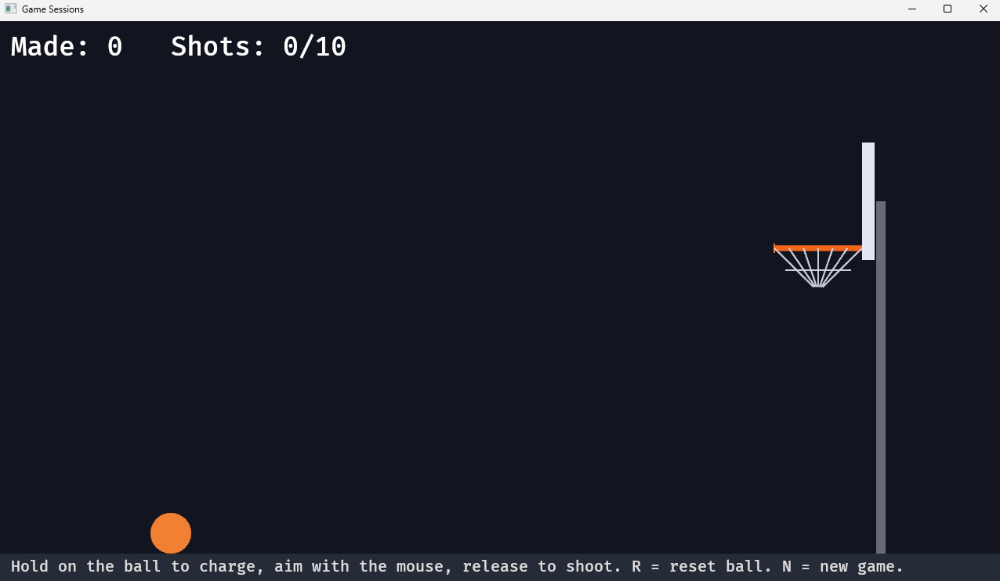

# Chapter 11 — Game Sessions

*Read this in: **English** | [Español](README.es.md)*

You can shoot, bounce, score, and celebrate — but you can't *lose*, and a game you can't lose is a screensaver. This chapter adds stakes: a session of limited shots, a game-over state that freezes the court, and a clean way to start fresh. It's a small amount of code, and almost all of it is *state design* — the part of gameplay programming that separates engineers from tinkerers.

**Time**: ~45 minutes.

## Step 1 — Two resources describe a session

```rust
// True once the shot limit is reached: shooting is frozen until a new game.
#[derive(Resource, Default)]
struct Stopped(bool);

// Max shots before the game stops. 0 = unlimited.
#[derive(Resource)]
struct ShotLimit(u32);

// A hand-written Default (instead of derive) so a fresh game has a real limit.
impl Default for ShotLimit {
    fn default() -> Self {
        ShotLimit(10)
    }
}
```

Register both with `.init_resource::<...>()` as usual.

> [!NOTE]
> **Rust sidebar: implementing a trait by hand.** Until now, every trait came from `#[derive(...)]` — the compiler wrote the code. But derived `Default` for `ShotLimit` would give `0` (unlimited), and we want new players to get a real 10-shot game. So for the first time in this course, we write a trait implementation ourselves: `impl Default for ShotLimit { ... }`. That's the whole ceremony — an `impl TraitName for TypeName` block containing the trait's functions. Deriving and hand-writing produce exactly the same kind of thing; derive is just the shorthand for the common cases.

A design note worth pausing on: why *two* resources? `Stopped` looks redundant — couldn't we just check `attempts >= limit` everywhere? We could, but "the game is over" is a *fact with consequences* (input freezes, HUD changes), and computing it from arithmetic in five places invites five subtle disagreements. Store the decision once, made at the moment it happens. And the `0 = unlimited` convention on `ShotLimit`? An engineer's alternative would be `Option<u32>` — `None` for unlimited — which is more honest Rust. We use the sentinel `0` deliberately: in the next chapter this number will come from an HTML control panel, and JavaScript speaks numbers, not `Option`s. Sometimes the interface picks the representation.

## Step 2 — Freezing the game

Two additions to `aim_and_launch` (whose signature gains `mut stopped: ResMut<Stopped>` and `limit: Res<ShotLimit>`). First, the gate — placed *after* the R-key handler and *before* any aiming:

```rust
    // Game over: the last shot can still finish flying, but no new charge starts.
    if stopped.0 {
        aim.active = false;
        aim.charge = 0.0;
        return;
    }
```

Second, the trigger — at the moment of release, right after `attempts.0 += 1`:

```rust
        // Count the shot; if that hits the limit, this is the last one — let it
        // fly, then freeze new shots until N starts a fresh game.
        if limit.0 > 0 && attempts.0 >= limit.0 {
            stopped.0 = true;
        }
```

Read the comment carefully, because this is deliberate game *feel* design: the tenth shot sets `stopped` **as it launches**, but nothing stops the ball — `physics` and `collisions` don't consult `Stopped` at all. Your final shot arcs, banks, and can still score while the HUD already says GAME OVER. Freezing the *input* without freezing the *world* is what makes the ending feel fair instead of abrupt. (Note what R deliberately doesn't do: it re-spots the ball but refunds nothing and un-ends nothing.)

## Step 3 — Starting fresh: the `new_game` system

```rust
/// N wipes the session — score, attempts, game-over flag — and re-spots the ball.
fn new_game(
    keys: Res<ButtonInput<KeyCode>>,
    mut score: ResMut<Score>,
    mut attempts: ResMut<Attempts>,
    mut stopped: ResMut<Stopped>,
    mut flash: ResMut<ScoreFlash>,
    mut aim: ResMut<Aim>,
    mut balls: Query<(&mut Ball, &mut Transform)>,
) {
    if !keys.just_pressed(KeyCode::KeyN) {
        return;
    }
    score.0 = 0;
    attempts.0 = 0;
    stopped.0 = false;
    flash.0 = 0.0;
    aim.active = false;
    aim.charge = 0.0;
    if let Ok((mut ball, mut tf)) = balls.single_mut() {
        reset(&mut ball, &mut tf);
    }
}
```

Nothing new in the mechanics — the interest is in the shape. A session reset touches *six pieces of state*, and this function is the complete, exhaustive list of what "a new game" means. When a bug report says "after a new game, X was stale," this is the single place to look. Register it at the *front* of the chain, so a fresh game takes effect before this frame's input is interpreted:

```rust
        .add_systems(Update, (new_game, aim_and_launch, physics, collisions).chain())
```

(Also worth noticing: `aim_and_launch` reads the keyboard for R, and `new_game` reads it for N. Resources aren't consumed — any number of systems can read `ButtonInput<KeyCode>` in the same frame.)

Update the instructions line in `setup` so players know:

```rust
        Text::new("Hold on the ball to charge, aim with the mouse, release to shoot. R = reset ball. N = new game."),
```

## Step 4 — A HUD that tells the whole story

`update_score_text` grows into its final form:

```rust
/// Rewrite the HUD only on frames where the session state actually changed.
fn update_score_text(
    score: Res<Score>,
    attempts: Res<Attempts>,
    stopped: Res<Stopped>,
    limit: Res<ShotLimit>,
    mut q: Query<&mut Text, With<ScoreText>>,
) {
    if !score.is_changed() && !attempts.is_changed() && !stopped.is_changed() && !limit.is_changed()
    {
        return;
    }
    let shots = if limit.0 > 0 {
        format!("{}/{}", attempts.0, limit.0)
    } else {
        format!("{}", attempts.0)
    };
    if let Ok(mut text) = q.single_mut() {
        text.0 = if stopped.0 {
            format!("Made: {}   Shots: {}     GAME OVER", score.0, shots)
        } else {
            format!("Made: {}   Shots: {}", score.0, shots)
        };
    }
}
```

Two small things and one nice thing: with a limit, shots display as `3/10`; without, just `3`. Game over appends the verdict. And the nice thing — `if`/`else` used as *expressions*, their result assigned directly to `shots` and `text.0`. In Rust, almost everything is an expression; you'll stop writing the `let x; if ... { x = a } else { x = b }` dance entirely.

## Run it

```
trunk serve        (or: cargo run)
```



Play a full session: ten shots, watch `7/10` tick up, sink what you can — then GAME OVER. Aim all you want: the ball ignores you (but your last shot finished its flight, and if it dropped, it counted). Press **N**. Clean court, `0/10`, go again. That loop — play, end, restart — is the difference between a demo and a game.

## Experiments before you move on

1. Speedrun sessions: change the hand-written `Default` to `ShotLimit(3)`.
2. Practice mode: `ShotLimit(0)` — the HUD switches to plain counting and the game never ends. Both display formats, one `if`.
3. Delete the `stopped.0` gate in `aim_and_launch` and play past the limit — the HUD screams GAME OVER while you keep scoring. Feel how *storing* the decision but *ignoring* it is worse than never deciding. Put it back.

## What you built / What's next

A complete session state machine: a limit with an "unlimited" mode, a frozen-but-fair ending, an exhaustive one-place reset, and a HUD that narrates it — plus your first hand-written trait implementation.

Your code should now match this chapter's folder: [`chapters/11-game-sessions/`](.).

**Part III is complete — the game is fully playable.** Part IV makes you an engineer: in **Chapter 12**, the web page around the game comes alive — an HTML control panel that sets the shot limit, shows live results, and resets the game, talking to Rust through `wasm-bindgen`.

**[Continue to Chapter 12: Talking to the web page →](../12-talking-to-the-web-page/README.md)**
