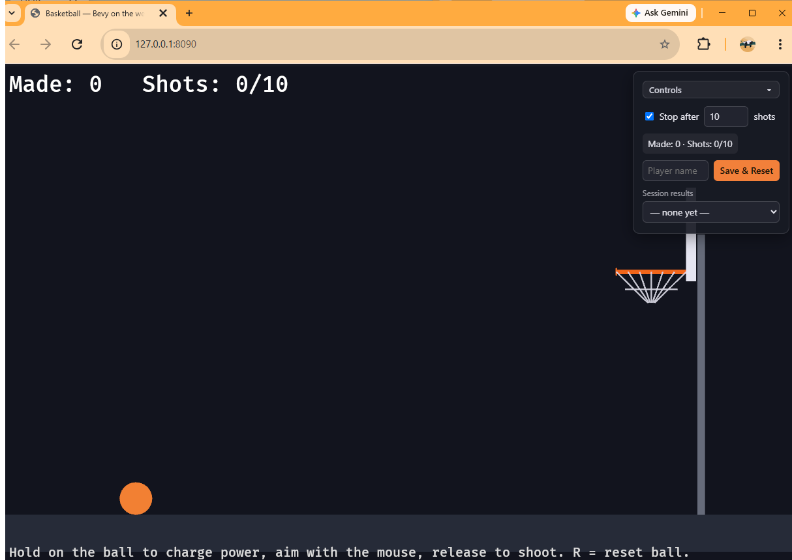

# Chapter 12 — Talking to the Web Page

*Read this in: **English** | [Español](README.es.md)*

**Part IV begins: from game programmer to engineer.** Your game runs *inside* a web page — but the page has been a passive frame. In this chapter it becomes part of the product: an HTML control panel that sets the shot limit, shows live score, saves named results to a dropdown, and starts new games — all talking to your Rust code across the WASM boundary. And when you're done, something worth pausing on: **your `main.rs` will match the finished game's, line for line.**

**Time**: ~1.5 hours.

## The architecture: one shared object

Rust and JavaScript live in different worlds. Our bridge between them is deliberately primitive: **one plain JavaScript object, `window.rustbyve`**, that both sides read and write:

| Field | Written by | Read by | Meaning |
|---|---|---|---|
| `shotLimit` | the panel | Rust, every frame | Max shots (0 = unlimited) |
| `resetRequested` | the panel (button) | Rust, take-and-clear | "Please start a new game" |
| `score`, `attempts`, `gameOver` | Rust, every frame | the panel | Live game state |

No callbacks into WASM, no message queues, no shared memory tricks. The panel leaves notes; the game reads them each frame, and writes its own. It's humble — and it's robust, debuggable (open the browser console and type `window.rustbyve`), and totally decoupled: either side works without the other.

## Step 1 — The bridge module

This is the chapter's centerpiece — a new module at the top of `main.rs`:

```rust
// Bridge to the HTML control panel. The two sides share a single `window.rustbyve`
// object: Rust publishes score/attempts/game-over out; the panel writes the shot
// limit and a one-shot reset request back in. On non-wasm builds these are no-ops
// so the crate still `cargo check`s on the host.
#[cfg(target_arch = "wasm32")]
mod bridge {
    use wasm_bindgen::prelude::*;

    #[wasm_bindgen(inline_js = r#"
        function rb_ensure() {
          if (!window.rustbyve) {
            window.rustbyve = { resetRequested: false, shotLimit: 0, score: 0, attempts: 0, gameOver: false };
          }
          return window.rustbyve;
        }
        // Reads and clears the reset flag in one call so a click can't be missed or double-counted.
        export function rb_take_reset() {
          const s = rb_ensure();
          const v = s.resetRequested;
          s.resetRequested = false;
          return v;
        }
        export function rb_shot_limit() { return rb_ensure().shotLimit | 0; }
        export function rb_publish(score, attempts, gameOver) {
          const s = rb_ensure();
          s.score = score | 0;
          s.attempts = attempts | 0;
          s.gameOver = !!gameOver;
          if (typeof window.rbOnState === "function") window.rbOnState(s);
        }
    "#)]
    extern "C" {
        pub fn rb_take_reset() -> bool;
        pub fn rb_shot_limit() -> i32;
        pub fn rb_publish(score: i32, attempts: i32, game_over: bool);
    }
}
```

Three new ideas, from the outside in:

- **`#[cfg(target_arch = "wasm32")]`** is *conditional compilation*: this module only exists in WASM builds. Native builds never see it — not "skipped at runtime," literally not compiled.
- **`extern "C" { ... }`** declares functions that exist *somewhere else* — Rust learns their signatures and trusts the linker. Combined with `#[wasm_bindgen]`, "somewhere else" means JavaScript.
- **`inline_js`** carries the actual JavaScript along inside the Rust file. Read those three JS functions — they're the entire protocol. And study `rb_take_reset`: it reads **and clears** the flag in one call. If Rust instead read the flag and cleared it separately, a click could be double-counted (or missed) between the two steps. *Take-and-clear* is how you hand one-shot events across any boundary.

## Step 2 — Stubs make it portable

The game code shouldn't care which platform it's on, so we give it one set of functions with two implementations:

```rust
#[cfg(target_arch = "wasm32")]
fn js_take_reset() -> bool {
    bridge::rb_take_reset()
}
#[cfg(target_arch = "wasm32")]
fn js_shot_limit() -> u32 {
    bridge::rb_shot_limit().max(0) as u32
}
#[cfg(target_arch = "wasm32")]
fn js_publish(score: u32, attempts: u32, game_over: bool) {
    bridge::rb_publish(score as i32, attempts as i32, game_over);
}

#[cfg(not(target_arch = "wasm32"))]
fn js_take_reset() -> bool {
    false
}
#[cfg(not(target_arch = "wasm32"))]
fn js_shot_limit() -> u32 {
    0
}
#[cfg(not(target_arch = "wasm32"))]
fn js_publish(_score: u32, _attempts: u32, _game_over: bool) {}
```

On the web, `js_shot_limit()` asks the panel. On desktop, it returns 0 — unlimited practice mode, no panel, and `cargo run` still works. This *stub pattern* is how real cross-platform code is written: the platform difference is contained in six tiny functions, and everything downstream is platform-blind.

## Step 3 — Two sync systems

The bridge gets used by two new systems bookending the game logic:

```rust
// Pull the shot limit from the panel every frame, and when the panel's Save & Reset
// fires, wipe the score/attempts and re-spot the ball for a brand-new game.
fn sync_from_js(
    mut score: ResMut<Score>,
    mut attempts: ResMut<Attempts>,
    mut stopped: ResMut<Stopped>,
    mut limit: ResMut<ShotLimit>,
    mut aim: ResMut<Aim>,
    mut flash: ResMut<ScoreFlash>,
    mut balls: Query<(&mut Ball, &mut Transform)>,
) {
    let new_limit = js_shot_limit();
    if limit.0 != new_limit {
        limit.0 = new_limit;
    }

    if js_take_reset() {
        score.0 = 0;
        attempts.0 = 0;
        stopped.0 = false;
        flash.0 = 0.0;
        aim.active = false;
        aim.charge = 0.0;
        if let Ok((mut ball, mut tf)) = balls.single_mut() {
            reset(&mut ball, &mut tf);
        }
    }
}

// Push the live game state to the panel so it can show progress and, on Save & Reset,
// read the final score/attempts for the record it stores.
fn sync_to_js(score: Res<Score>, attempts: Res<Attempts>, stopped: Res<Stopped>) {
    js_publish(score.0, attempts.0, stopped.0);
}
```

Look closely at `sync_from_js`'s reset block — it's Chapter 11's `new_game`, verbatim. The *what* of a session reset didn't change; only the *trigger* moved, from the N key to the panel's button. That's why the chain becomes:

```rust
        .add_systems(
            Update,
            (sync_from_js, aim_and_launch, physics, collisions, sync_to_js).chain(),
        )
```

Inbound state first, game logic in the middle, outbound state last — a frame-loop shape you'll recognize in every networked or embedded system you ever touch. (The `new_game` system and its N key are deleted; `ShotLimit` goes back to `#[derive(Default)]` — 0 — because the panel is now the source of truth. The keyboard `R` stays: re-spotting the ball is gameplay, not session management.)

Two small changes finish the Rust side: the `Window` config becomes web-native —

```rust
            primary_window: Some(Window {
                canvas: Some("#bevy".into()),
                fit_canvas_to_parent: true,
                ..default()
            }),
```

— meaning "render into the page's `<canvas id="bevy">` and match its size" (the page owns layout now; `AutoMin` keeps the court framed within whatever shape that is). And since the panel displays the score, this is where you could remove the in-game HUD — the real game keeps both, so we do too.

## Step 4 — The panel itself

The full `index.html` for this chapter is in [this chapter's folder](index.html) — it's ~230 lines and all of it is ordinary web dev: a floating `<div>` with a checkbox and number input for the limit, a status line, a name field, a Save & Reset button, a results `<select>`, and CSS to make it feel native to the game. Copy it in, then read the `<script>` at the bottom against the table at the top of this lesson:

- It **creates `window.rustbyve` first** (before the WASM loads — whoever arrives first creates it, the other reuses it; `rb_ensure` on the Rust side is the same defensive move).
- `applyLimit()` mirrors the checkbox/number into `rb.shotLimit` — including the `0 = unlimited` convention from Chapter 11, now revealed as the panel's native language.
- `window.rbOnState` is called by `rb_publish` every frame — it rewrites the status line and flips it green on game over.
- The Save & Reset button records `{name, made, shots}` into the dropdown (auto-naming blank entries), then sets `rb.resetRequested = true` — the note Rust will take-and-clear on its next frame.

One Trunk detail changed in the `<head>`: `<link data-trunk rel="rust" data-wasm-opt="z" />` — the new attribute asks Trunk to run the `wasm-opt` size optimizer on release builds. It's a seed planted for Chapter 14.

## Run it

```
trunk serve
```



Play a 10-shot session. Watch the panel's status tick in lockstep with the HUD (same state, two displays, one source of truth). Hit the limit — the panel line turns green: *Game over — 3 made in 10*. Type your name, click **Save & Reset**: your run appears in the dropdown and a fresh game starts. Change the limit mid-game; the HUD's `x/10` becomes `x/5` instantly. Then open the browser console and type `window.rustbyve` — there's your whole protocol, live.

And with that: **compare your `main.rs` against the finished game's — they're the same file.** Everything from Chapter 0's screenshot, you have now written.

## Experiments before you move on

1. In the console: `window.rustbyve.resetRequested = true` — you can drive the game from JavaScript by hand. That's the whole bridge, demystified.
2. Add a field: publish the ball's current speed via `rb_publish` (extra arg through the bridge) and show it live in the panel. Touching all four layers — Rust call, JS glue, shared object, panel DOM — once, on purpose, is the best way to own the pattern.
3. `cargo run` on the desktop: no panel, unlimited shots, everything else intact. The stubs at work.

## What you built / What's next

A real Rust↔JavaScript bridge: conditional compilation, `wasm-bindgen` externs with inline JS, the shared-object protocol with take-and-clear semantics, and inbound/outbound sync systems bookending the frame — plus a finished, panel-controlled game identical to the reference implementation.

Your code should now match this chapter's folder: [`chapters/12-talking-to-the-web-page/`](.).

In **Chapter 13**, we take this one-file game apart and put it back together the way a team would ship it: modules, plugins, and a workspace.

**[Continue to Chapter 13: Refactoring like an engineer →](../13-refactoring-like-an-engineer/README.md)**
